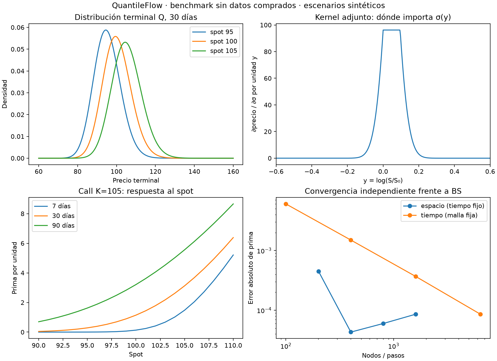

# QuantileFlow: primer PDE, adjunto y avance sin comprar datos

Fecha: 9 de octubre de 2026. Presupuesto vigente: **US$0**.
Rama de trabajo: `codex/pde-captura-gratis-20261009`, sobre `fb4db927496f147ce623748d9f1e7022b36fc3c9`.

Ya implementé y verifiqué el primer solver europeo de precios y distribuciones
compatibles, con sensibilidades adjuntas. También probé la captura ampliada
con cinco plazos en una API sintética y revisé el crudo real disponible.
La captura ampliada **no está desplegada** ni medida en vivo: las claves de
Alpaca no están configuradas en este entorno local. No se compraron datos.

## 1. Qué quedó construido

| Parte | Implementación | Qué permite comprobar |
|---|---|---|
| Motor numérico | `quantileflow/pde.py` | Precio europeo y masas terminales con el mismo operador |
| Adjunto discreto | En ese motor | Sensibilidad a todos los nodos de volatilidad en una pasada inversa |
| Sensibilidades | Delta, vega paralela, tasa y rendimiento continuo | Cómo cambia la prima cuando cambian los supuestos |
| Benchmark | `experiments/pde_gratis_20261009/benchmark.py` | 90 calls/puts contra BS, Taylor y refinamientos |
| Captura ampliada | Pruebas de integración en `tests/test_alpaca.py` | SPXW y SPY, 7/14/30/60/90 días, metadatos de 120 días y paginación |
| Runner privado | `experiments/pde_gratis_20261009/captura_manual.py` | Plan sin red por omisión; prueba inmediata limitada cuando haya claves |
| Auditor de archivos | `experiments/pde_gratis_20261009/auditar_crudo.py` | SHA-256 gzip y contenido JSON; solo publica agregados |

El código queda en el repo existente `hectorcs23/QuantileFlow`, en una rama
experimental separada. El cambio no instala ningún servicio ni programa nuevas
corridas de GitHub Actions. La captura diaria continúa con su configuración vigente.

## 2. Matemática: relación entre precio y distribución

En coordenadas `y = log(S/S₀)`, el proceso europeo de referencia tiene deriva
`μ = r − q − σ(y)²/2` y difusión `D = σ(y)²/2`. Para sigma constante recupera
Black–Scholes. Para sigma espacial, es una difusión de referencia con coeficiente
estático en esas coordenadas; **no es una sonrisa IV calibrada**.

El generador discreto `G` tiene tasas de salto no negativas. Si la malla no
permite positividad, el solver rechaza la entrada. Se usan fronteras reflectantes,
Euler implícito y un payoff promediado por celda:

```text
A = I − Δt G
A m[k+1] = m[k]
J = exp(−rT) payoffᵀ m[M]
```

`m` representa masas de probabilidad, no valores de densidad. La gráfica en
precio transforma esas masas con el Jacobiano `dS = S dy`. Las masas terminales
son bajo **Q, neutral al riesgo**: no dan directamente la probabilidad real de
subir ni la confianza de una recomendación de trading.

El mismo operador, transpuesto, proporciona la valoración hacia atrás y el adjunto:

```text
λ[M] = exp(−rT) payoff
Aᵀ λ[k] = λ[k+1]
∂J/∂θ = contribución explícita − Σ λ[k]ᵀ A_θ m[k+1]
```

Esta es la parte de la metodología PDE constrained optimization que ya se
implementó: residual discreto, transpuesta consistente, gradiente del sistema
discretizado y prueba de Taylor. Para la tasa se incluye también la derivada del
descuento. El delta deriva el payoff transformado manteniendo sigma fija en
coordenadas relativas al spot. Una superficie calibrada que se mueva con el spot
requerirá una convención adicional y derivar esa recalibración.

El gradiente espacial de sigma responde «en qué regiones del precio importa más
una perturbación de volatilidad». Su suma es la vega de una perturbación paralela.
Todavía no resuelve una optimización de contratos ni un problema inverso de calibración.

## 3. Verificación numérica y apoyos visuales

Benchmark: spot sintético 100, strikes 90/100/110, sigma 15/25/45 %, DTE
7/14/30/60/90, calls y puts; tasa 4 % y rendimiento continuo 1.3 %.
Malla de 1,601 nodos, 2,400 pasos y dominio `y ∈ [−1.5, 1.5]`.

| Comprobación | Resultado máximo observado |
|---|---:|
| Error absoluto de prima frente a BS | 0.000464786 por unidad del subyacente |
| Error de delta | 0.0000353223 |
| Error de vega, por incremento absoluto de sigma | 0.00176767 |
| Error de conservación de masa | 8.12 × 10⁻¹³ |
| Diferencia entre valoración forward y backward | 3.91 × 10⁻¹⁴ |
| Masa en los dos nodos de frontera | 2.72 × 10⁻¹² |
| Error del gradiente espacial frente a diferencias centrales | 2.13 × 10⁻⁹ |

El resto de Taylor cae aproximadamente por factores 3.988, 3.994 y 3.997 al
dividir la perturbación por dos, compatible con un resto de segundo orden.
Los tests también contrastan delta, vega, tasa y dividendo continuo contra
perturbaciones centrales en la misma discretización, para calls y puts.

**Pasaron 270 pruebas:** suite de 268 pruebas, incluyendo los dos experimentos
anteriores y las nuevas pruebas PDE/captura, más dos pruebas del auditor agregadas
después y ejecutadas por separado. El benchmark de 90 casos es una verificación
numérica adicional. Se inspeccionó la gráfica generada y `git diff --check` pasó.

Los errores de espacio y tiempo pueden cancelarse. Al refinar solo el espacio
con tiempo fijo, el error frente a BS no baja de forma monótona en este caso;
el JSON conserva esa evidencia. El refinamiento conjunto pasó de 0.005495 a
0.00008578. Un dominio corto conserva masa y aun así sesga el precio: el test
detecta ese caso. No se afirma que esos límites cubran cualquier parámetro futuro.



Los CSV contienen únicamente casos **sintéticos**. `verificacion.json` registra
las cifras y huellas de los archivos fuente usados en esta máquina. Las figuras
ilustran escenarios condicionados a supuestos, no pronósticos.

## 4. Datos reales existentes y captura ampliada

Se obtuvo una copia del snapshot privado
`8adb35f6abcaaa238c2bca48169d4a23dc9c99b1` sin alterar el clon local que tenía
cambios. Las páginas reales permanecen fuera del checkout público.

La auditoría comprobó **195 páginas únicas** referenciadas por 13 manifiestos
de capturas, 30 históricos y 8 consultas de eventos. Pasaron las huellas tanto
del archivo como del contenido descomprimido y la lectura JSON. Esto comprueba
integridad de almacenamiento; no demuestra que indicative reproduzca precios OPRA.

Para el viernes 9:

- Ambos cortes y los dos históricos SIP figuran completos con código `4ffde8a`.
- Las ráfagas de opciones duraron 0.694 y 0.745 segundos; ninguna respuesta
  quedó después del corte ni hubo errores registrados. Es el tiempo de la ráfaga
  actual, no los 29/44 minutos de duración total de los workflows.
- La reconstrucción produjo 6,880 filas de cotizaciones de los dos cortes,
  2,004 filas de subyacente, cinco versiones de eventos y ocho consultas de eventos.
- El resumen reconstruido de dividendos no tiene retiros ni discrepancias abiertas.
- El diagnóstico estricto reprodujo las cifras comunicadas por Claude:
  **3,112 y 3,114 filas válidas de 3,440** en cada corte, respectivamente.
  La ejecución local requirió `MPLBACKEND=Agg` para generar gráficas sin Tk.

La captura actual pide cinco cadenas SPXW y cuatro SPY. Aplicando la selección
ampliada solo a los metadatos disponibles del viernes, la unión pide **15 SPXW
y 12 SPY**: 27 cadenas frente a 9. Esos metadatos cubren solo 50 días; permiten
rodear 7/14/30, pero no 60/90. No se extrapolan esas cifras a la ventana de 120
días ni se asume que todas las cadenas vayan a tener una sola página.

La integración sintética probó ambos cortes, dos raíces, cinco plazos, cadenas
con varias páginas y metadatos de 120 días. En cada corte terminó completa con
98 respuestas y 652 cotizaciones. El tiempo cero del reloj simulado **no mide
latencia de Alpaca**. Las cotizaciones sintéticas SPY prueban transporte y esquema,
no exactitud de un modelo americano.

El runner manual exige destino nuevo fuera de Git, indicative/IEX, límites de
concurrencia/reintentos y timeout global de 180 segundos. Sin `--ejecutar` solo
presenta el plan; con claves ausentes se detiene antes de arrancar la captura.
No se recuperaron claves desde GitHub ni se lanzaron Actions adicionales.

## 5. Próximos pasos, todos con presupuesto cero

1. **Medir una captura ampliada real aislada** cuando haya credenciales ya
   configuradas en el entorno de ejecución. Contar páginas, solicitudes,
   reintentos, errores 429 y tiempo; revisar cobertura de 7/14/30/60/90.
2. **Comprobar el horario causal.** La prueba inmediata mide carga, pero una
   prueba a las 09:45/10:00 debe verificar disponibilidad y recepción al corte.
   Si falla, reducir vencimientos por lado o separar las mediciones adicionales
   del piloto principal. La ventana de cinco segundos no se da por suficiente.
3. **Añadir sensibilidad de la distribución.** Obtener derivadas de CDF,
   cuantiles y probabilidades de cola, además de la prima; validar contra
   perturbaciones y precisar qué permanece fijo al cambiar el spot.
4. **Calibración controlada.** Primero recuperar una sigma conocida desde
   precios sintéticos. Luego ensayar regularización y perturbaciones dentro
   de los spreads de datos reales. No derivar densidades de una superficie
   ruidosa sin medir estabilidad, arbitraje y dependencia de supuestos.
5. **Conectar al selector de contratos.** Comparar strikes/DTE según movimiento
   esperado, tiempo hasta salida, cambios de IV y presupuesto de operación,
   usando el motor de escenarios existente. La recomendación será condicional
   al escenario, con spreads y costos; no una garantía de ganar más.

SPY americano con dividendos en efectivo requiere su tratamiento específico;
el benchmark europeo nuevo no lo sustituye. La deriva física, la dirección
esperada, gamma/theta completos y la diferenciación de una recalibración quedan
para etapas posteriores. El solver actual almacena toda la trayectoria de masas;
su memoria crece con nodos × pasos y aún no tiene checkpointing.

**Decisiones vigentes:** cero gasto en datos; cinco plazos objetivo; SPXW y SPY
separados; primera validación sintética; ninguna activación de captura ampliada
hasta medir carga y elegibilidad. La prioridad es tener un motor verificable y
datos comparables antes de atribuir una señal predictiva.
