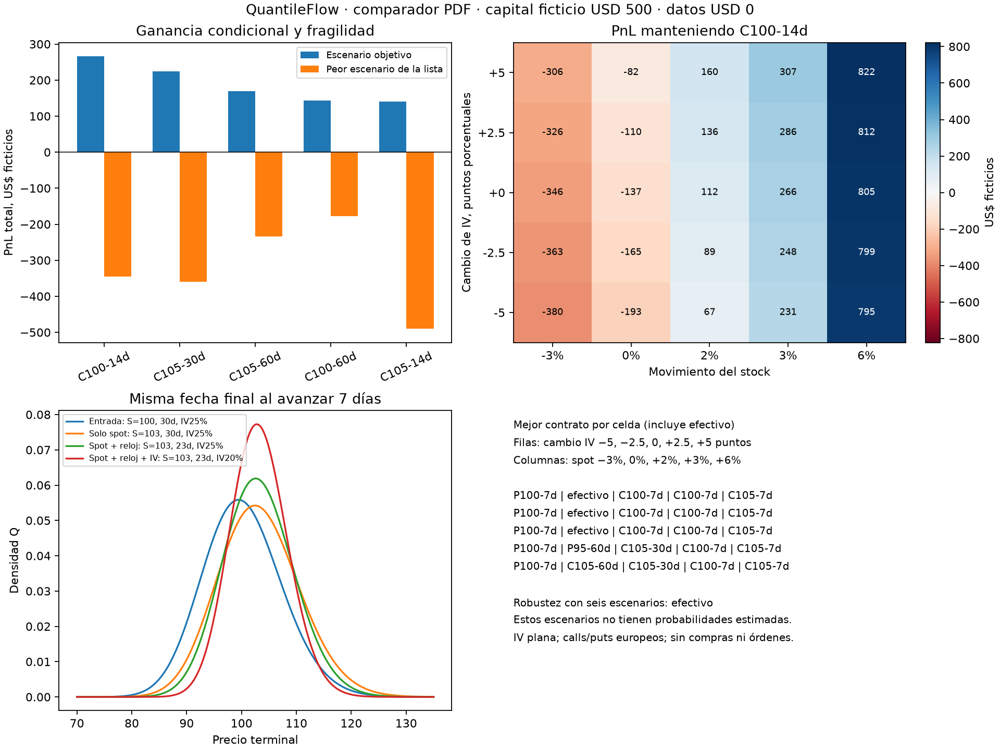

# QuantileFlow: comparador de contratos y análisis de sensibilidad

Fecha: 10 de octubre de 2026. Presupuesto de datos: **US$0**.
Rama: `codex/pde-captura-gratis-20261009`. Base: `1a2c18f`.

Ya conecté el comparador existente al motor PDE que utiliza una sola PDF para
precios y probabilidades Q. Puede recibir contratos, movimiento del subyacente,
tiempo hasta salida, cambios de IV, presupuesto y límite de pérdida. Devuelve
cantidades enteras, costos, sensibilidades y tres rankings separados.

Se ejecutó una demo con 24 contratos sintéticos, seis escenarios y capital
ficticio de US$500. **No se compraron datos ni se hicieron operaciones.** No se
cambiaron los workflows ni las capturas de mercado. Los US$500 ilustran el uso;
no representan dinero disponible ni autorización para operar.

## Qué quedó implementado

- `quantileflow/escenarios.py` admite `motor="pde"` para europeos con q continuo.
  El motor anterior, Black–Scholes/CRR, sigue siendo la opción por defecto.
- `quantileflow/comparador.py`, API `comparar_con_pdf`, añade rankings por dólares
  ganados en el escenario objetivo, retorno sobre capital reservado y mínimo
  PnL de los escenarios. No mezcla esos objetivos en un score.
- Cada candidato representa comprar una sola serie de opciones largas. Se usa
  la cantidad entera máxima que cabe en capital y límite de pérdida, reservando
  las comisiones de entrada y salida. No se optimiza la cantidad ni una cartera.
- Se compra a ask. Antes del vencimiento se supone salida a valor del modelo
  menos un semispread, con piso cero. Al vencer se usa payoff intrínseco sin
  semispread y con comisión conservadora de cierre. Las cotizaciones futuras
  siguen siendo supuestos.
- El límite de pérdida cubre prima y ambas comisiones. El mínimo de la lista de
  escenarios puede ser mucho menos severo que perder toda esa cantidad.
- Un vencimiento anterior a cualquier escenario se excluye: no se utiliza el
  stock de una fecha posterior para valorar una opción ya vencida.
- Se devuelven delta, gamma, vega por punto de IV y theta por día, por unidad de
  subyacente. Para obtener el cambio monetario de la posición se multiplica por
  cantidad y multiplicador. Los escenarios se revaloran completamente.
- Las distribuciones se reutilizan entre strikes que comparten spot, IV y plazo.
  Sus colas, cuantiles y valoración provienen de la misma reconstrucción.

El ranking robusto compara su mejor contrato con mantener efectivo, cuyo PnL
se supone cero. Si ningún contrato mejora ese cero en todos los escenarios de
la lista, devuelve `efectivo`. Esta regla no es una garantía fuera de la lista.

Se excluyen dominios con masa en fronteras mayor a 10⁻⁶ o error de momento
mayor a 10⁻³ del spot correspondiente; ambas tolerancias son configurables.
También se hizo refinamiento de la demo: superar estos filtros no demuestra
por sí solo convergencia del precio ni estabilidad del ranking.

## Resultado del ejemplo

Spot 100, IV 25%, tasa 4%, q continuo 1.3%, strikes 95/100/105, DTE
7/14/30/60 y calls/puts. Las primas de entrada son Black–Scholes ±0.04
sintéticos. Comisión 0.65 por contrato y lado; semispread de salida 0.04.

El escenario objetivo es **+3% en siete días**. Los controles son ausencia
de movimiento, −3%, caída de IV de cinco puntos, llegada siete días tarde
y subida de IV de cinco puntos. No se asignaron probabilidades a esos escenarios.

De 24 candidatos, 12 pasan presupuesto y horizonte. En la malla de 401 nodos y
400 pasos:

| Candidato | Ganancia en objetivo | Mínimo de los seis escenarios |
|---|---:|---:|
| Call strike 100, DTE 14, dos contratos | +266.32 | −345.61 |
| Call strike 105, DTE 30, cuatro contratos | +223.67 | −360.03 |
| Call strike 105, DTE 60, dos contratos | +170.03 | −234.57 |
| Call strike 100, DTE 30, un contrato | +137.22 | −175.47 |

Todas las cantidades monetarias son US$ ficticios. El primero por ganancia y
retorno es el call ATM de 14 días. El menos malo por mínimo de escenarios es
el call ATM de 30 días. **Efectivo gana la comparación robusta** porque todos
los contratos tienen algún escenario negativo.

Para el call de 14 días se reservan 411.26 de los 500; no se supone que se invierte
todo el capital. Su sensibilidad local inicial por unidad es delta 0.518,
gamma 0.0817, vega 0.0779 por punto de IV y theta −0.0732 por día. La repricing
completa produce el PnL del ejemplo; la aproximación local no se extrapola siete días.

El barrido añadió **25 combinaciones de movimiento/IV** y **16 variaciones de
tiempo, costos y presupuesto**. Aparecen siete alternativas diferentes en el
mapa de preferencia, incluyendo efectivo. Con el mismo +3% objetivo:

- Salida en 1–3 días: encabeza el call strike 105, DTE 14.
- Salida en siete días: encabeza el call strike 100, DTE 14.
- Salida en 14–30 días: encabeza por dólares el call strike 100, DTE 60.
  A 14 días, por retorno encabeza DTE 30: los objetivos ya eligen distinto.
- Con capital ficticio 100 cambia el ganador a strike 105/DTE 14; con 250–1,000
  gana strike 100/DTE 14. La cantidad entera y el dinero libre influyen.
- Cambiar el semispread de salida entre 0 y 0.40 redujo PnL sin cambiar los
  primeros contratos en esta demo. Eso no garantiza estabilidad en otras cadenas.

El mapa permite cambiar de contrato entre celdas para mostrar preferencias
condicionales. No representa una estrategia que conoce el resultado de antemano.
El PnL del contrato elegido inicialmente se presenta por separado.



La PDF ilustra por separado movimiento de spot, siete días menos de plazo y
caída de IV, manteniendo la misma fecha final al avanzar el reloj. Estas
distribuciones describen precios terminales **Q**, no probabilidades físicas
de que el movimiento esperado vaya a ocurrir.

## Verificación y límites

**319 pruebas pasadas**, incluyendo 17 nuevas. Se verificaron PnL frente a
un oráculo Black–Scholes independiente, puts/calls, costos, límite de pérdida,
horizonte exacto y posterior, rankings que eligen tres ganadores distintos,
empates, abstención aun con probabilidad Q ITM alta, exclusión de dominios cortos
y sensibilidades ante perturbaciones pequeñas. La regresión comprueba también
que un generador de dividendos se reutilice para todos los contratos del motor clásico.

La malla fina de **801 nodos y 1,200 pasos** mantuvo los tres rankings,
los candidatos y la alternativa robusta. El mayor cambio de PnL total entre
las dos mallas fue **3.1831**. Las cifras de la tabla corresponden a la malla
gruesa, no a precisión monetaria garantizada. Se inspeccionó la figura final.

`resultados/verificacion.json` conserva parámetros y hashes de fuentes
normalizadas a LF. `entrada.json` permite reconstruir las cotizaciones sintéticas;
los CSV registran PnL y sensibilidad. El gasto en datos se registra como cero.

El comparador PDE rechaza ejercicio americano y dividendos en efectivo; no los
convierte silenciosamente en europeos. El motor CRR anterior sigue separado.
No se modelan entrega física, impuestos, financiación ni interés de caja.
Tampoco liquidez, tamaño disponible, slippage variable, superficie calibrada
o reacción empírica del skew. La IV por contrato es plana en su valoración.

**Q ITM no significa probabilidad de ganar.** Las probabilidades y cuantiles de
cada escenario se refieren al vencimiento restante, no al PnL de la salida.
Para ganancia esperada física falta calibrar y validar probabilidades de escenarios.

## Uso y siguiente paso

```python
from quantileflow.comparador import comparar_con_pdf
from quantileflow.escenarios import ContratoEscenario, Escenario

c = ContratoEscenario("ejemplo", 100, 30, True, "europeo", .25, 2.8, 3.)
es = [Escenario("objetivo", 7, .03), Escenario("adverso", 14, -.03, -.05)]
r = comparar_con_pdf([c], 100, es, presupuesto=500,
                      escenario_objetivo="objetivo", limite_perdida=350,
                      fuente_cotizaciones="ejemplo sintético")
print(r["rankings"], r["alternativa_robusta"])
```

La demo se ejecuta con `python experiments/comparador_pdf_20261010/demo.py`.
Admite `--presupuesto`, `--movimiento`, `--dias` y `--salida`.

Sigue probar un adaptador de una cadena gratuita ya capturada, con sellos de
spot/opciones, ejercicio, bid/ask y multiplicador verificados. Primero compararemos
error del modelo contra bandas de mercado y estabilidad de rankings bajo esas
bandas. Para acciones americanas hace falta validar el motor correspondiente
y dividendos antes de elegir contratos. Después vendrá la dinámica del skew
y la evidencia fuera de muestra. El presupuesto de datos permanece en US$0.
