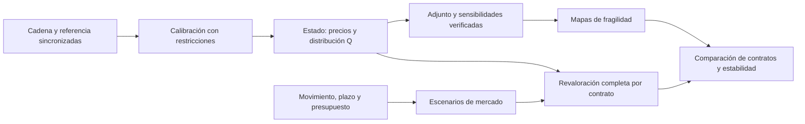
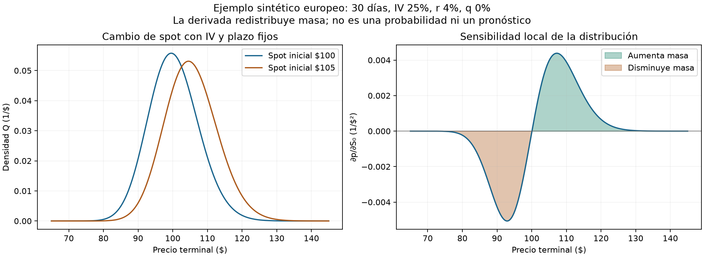

# QuantileFlow: sensibilidad y optimización restringida por PDE

Fecha: 8 de octubre de 2026. Estado: propuesta metodológica y verificación analítica inicial. El solver PDE, el adjunto y la calibración descritos abajo son trabajo pendiente; el ejemplo ejecutado utiliza fórmulas analíticas y cuadratura.

## 1. Propuesta y utilidad

Adoptar una arquitectura de estado, parámetros, objetivo y adjunto para calcular cómo los supuestos afectan el precio de una opción, la distribución implícita y la estabilidad de la elección de contrato. El software debe explicar qué tendría que ocurrir para que un contrato sea atractivo y cuánto cambia esa conclusión si el movimiento llega tarde, cambia la volatilidad o empeoran los costos.

El enfoque extiende el prototipo actual de escenarios. Ese prototipo ya revalora opciones europeas y americanas, compara contratos enteros con presupuesto y devuelve resultados condicionales. Hoy usa Black–Scholes y un árbol CRR; todavía no calcula sensibilidades de una superficie mediante un adjunto PDE. La metodología propuesta constituye una ampliación experimental.

La sensibilidad mide la respuesta de un modelo a cambios especificados. La predicción exige aprender qué cambios ocurrirán y con qué frecuencia. Mantendremos esas dos preguntas identificadas en cada resultado.

## 2. Qué leí y qué dice la evidencia

Identifiqué el [Computational Aerodynamics Group de McGill, dirigido por Siva Nadarajah](https://sites.google.com/view/mcgill-computational-aerogroup/research), y contrasté las referencias con sus [publicaciones](https://sites.google.com/view/mcgill-computational-aerogroup/publications).

| Fuente original | Alcance de la lectura | Aporte a la propuesta |
|---|---|---|
| Shi-Dong y Nadarajah, *Full-Space Approach to Aerodynamic Shape Optimization*, arXiv:2011.13461 | Texto de 36 páginas: formulación, costos, experimentos y apéndices; ecuaciones del adjunto verificadas en la página renderizada | Estado restringido por PDE, adjunto, Hessiana y comparación de costos |
| Nadarajah y Jameson, *A Comparison of the Continuous and Discrete Adjoint Approach to Automatic Aerodynamic Optimization*, AIAA 2000-0667 | Secciones de formulación, discretización, verificación y conclusiones del texto publicado por sus autores | Consistencia entre solver y derivadas; contraste con diferencias finitas |
| Brown y Nadarajah, *Effect of inexact adjoint solutions on the discrete-adjoint approach to gradient-based optimization*, 2022 | Resumen y ficha del editor; no conseguí acceso al texto completo | Motivación para estudiar tolerancias adaptativas, pendiente de reproducir su algoritmo |

El artículo de Shi-Dong y Nadarajah compara un método reducido con un método LNKS que actualiza estado, diseño y adjunto conjuntamente. Su caso es un diseño inverso de flujo Euler bidimensional. El mejor precondicionamiento aproximado reduce el trabajo en ese benchmark, pero el escalamiento depende de los precondicionadores. Adoptamos su organización matemática; el beneficio computacional en finanzas habrá que medirlo. [Texto original](https://arxiv.org/pdf/2011.13461).

El artículo de Nadarajah y Jameson es de 2000 y corresponde a trabajo en Stanford, anterior al grupo actual de McGill. En sus casos, el adjunto discreto coincide mejor con diferencias finitas, aunque la mejora del costo objetivo no resulta significativamente distinta. También estudian lo que ocurre al congelar coeficientes dependientes del estado. Nuestra elección del adjunto discreto responde a la necesidad de verificar el software que ejecutamos. [Texto de los autores](https://www.researchgate.net/publication/238124248_A_Comparison_of_the_Continuous_and_Discrete_Adjoint_Approach_to_Automatic_Aerodynamic_Optimization), [DOI](https://doi.org/10.2514/6.2000-667).

El resumen de Brown y Nadarajah indica que adaptar las tolerancias del estado y del adjunto según la norma del gradiente es suficiente para conservar el orden de convergencia bajo su análisis. No trasladaremos esa garantía a nuestra calibración ni copiaremos un algoritmo sin leer su texto completo. [Editor](https://link.springer.com/article/10.1007/s11081-021-09681-5).

Las secciones siguientes son nuestra adaptación a opciones, no resultados financieros demostrados por McGill.

## 3. Correspondencia con QuantileFlow

| En aerodinámica | En nuestro sistema |
|---|---|
| Estado de presión y velocidad | Valores de opciones o masas de probabilidad en una malla |
| Parámetros de geometría | Coeficientes de volatilidad local, tasas y dividendos |
| Ecuaciones del flujo | Ecuación de valoración y ecuación de evolución de la distribución |
| Objetivo de diseño | Error de calibración o una medida escalar de precio/distribución |
| Sensibilidad del objetivo | Efecto de cada parámetro sobre esa medida |
| Verificación de malla y gradiente | Refinamiento de precios, distribuciones y sensibilidades |

El movimiento futuro del stock será una entrada de escenario. Las decisiones son qué contrato y cuántas unidades comprar. Los parámetros de volatilidad se estiman o se estresan; no se eligen libremente para producir una ganancia favorable.



## 4. Modelo de estado: precios y distribuciones

El primer benchmark será europeo, con tasas y rendimiento de dividendo deterministas. Bajo la medida de valoración Q:

$$dS_t=(r-q)S_t\,dt+\sigma_{loc}(S_t,t;\theta)S_t\,dW_t^Q.$$

La ecuación hacia atrás de una opción europea es

$$V_t+(r-q)S V_S+\tfrac12\sigma_{loc}^2 S^2 V_{SS}-rV=0,
\qquad V(T,S)=g(S).$$

La densidad de transición hacia adelante satisface

$$p_t=-\partial_S[(r-q)Sp]+\tfrac12\partial_{SS}[\sigma_{loc}^2S^2p],
\qquad p(t_0,S)=\delta(S-S_0).$$

El puente que debe verificarse es

$$V(t_0,S_0)=e^{-\int_{t_0}^{T}r(s)ds}\int_0^\infty g(s)p(T,s\mid t_0,S_0)\,ds.$$

Empezaremos con una malla unidimensional, paso temporal implícito y un esquema que preserve positividad y masa, con dominio y condiciones de frontera documentados. La difusión en precio logarítmico simplifica el benchmark; las colas y las fronteras siguen necesitando comprobación. No adoptaremos el discretizador DG del flujo Euler únicamente por su presencia en el artículo.

Para masas discretas m, un paso de transición P debe conservar masa y tener entradas no negativas. Su valoración dual utiliza `v_anterior = descuento * P.T @ v_siguiente`. Esta identidad permite comprobar que el solver de precios y el de distribución representan el mismo proceso. Con una densidad nodal, la transposición requiere además los pesos de integración.

La dualidad de los operadores de precios y probabilidades está relacionada con el método adjunto, pero el adjunto de una función objetivo tiene sus propias condiciones y depende del objetivo elegido.

En el caso europeo suave con tasas deterministas, también compararemos la densidad con

$$p^Q(T,K)=e^{\int_{t_0}^{T}r(s)ds}\partial_{KK}C(t_0,K,T).$$

La derivada respecto al strike identifica la densidad; gamma es la derivada respecto al spot. No intercambiaremos esas dos cantidades. La conexión entre opciones y precios de estados se fundamenta en [Breeden y Litzenberger, 1978](https://papers.ssrn.com/sol3/papers.cfm?abstract_id=2642349).

Para SPY y acciones individuales, el ejercicio americano introduce una restricción de obstáculo y cambios del conjunto de ejercicio. Los dividendos en efectivo requieren saltos en el estado y derivar su interpolación. Esa extensión irá después del benchmark europeo, contrastada con el CRR actual; no trataremos las opciones americanas como europeas para extraer una PDF.

## 5. Sensibilidad mediante adjuntos

Tras discretizar, escribimos el estado como `R(u, θ) = 0`. u contiene los estados de la malla y del tiempo; θ contiene los parámetros. J es una salida escalar, como el error de calibración, el valor de una opción o la masa de una región terminal.

Suponiendo diferenciabilidad y un Jacobiano de estado invertible:

$$R_u\,\frac{du}{d\theta}=-R_\theta.$$

Con la convención del artículo, `L = J + λᵀR`, resolvemos

$$R_u^T\lambda=-\nabla_u J,$$

y obtenemos

$$\frac{dJ}{d\theta}=\nabla_\theta J+R_\theta^T\lambda.$$

El algoritmo calcula el estado, forma las derivadas del residual, resuelve el sistema transpuesto y ensambla el gradiente. Se derivan también fronteras, descuentos, dividendos e interpolaciones. Utilizaremos diferenciación automática de los operadores cuando corresponda, con derivadas explícitas para el benchmark sencillo. No basta con aplicar autodiferenciación a un wrapper que oculta un solver.

Un adjunto corresponde a una salida escalar. Si tenemos cientos de parámetros y pocas salidas, puede ser atractivo. Si solo variamos spot y dos parámetros y queremos toda la PDF, las ecuaciones tangentes pueden ser más económicas. Compararemos costos medidos y reutilización de factorizaciones; no prometeremos un adjunto para todas las salidas gratuitamente.

Las sensibilidades parciales de parámetros fijos y las que incluyen recalibración se informarán por separado. Cuando se necesite `dθ*/d cotización`, habrá que diferenciar las condiciones de optimalidad de la calibración, incluyendo restricciones activas e identificabilidad. La respuesta futura de la superficie al stock no se obtiene diferenciando la calibración de hoy.

## 6. Qué mapas de sensibilidad construiremos

| Salida | Perturbación | Interpretación |
|---|---|---|
| Precio y PnL por contrato | Spot, tiempo, IV, tasas, dividendos | Cuánto cambia el resultado manteniendo identificados los demás supuestos |
| Masa por intervalos y CDF | Spot y parámetros de superficie | Dónde aumenta o disminuye la probabilidad Q |
| Cuantiles y colas | ATM, skew, curvatura y estructura por plazo | Qué aspectos de la distribución resultan frágiles |
| Distancia entre distribuciones | Perturbación de la distribución evaluada | Cuánto depende el transporte de datos y modelo |
| Diferencia de resultado entre candidatos | Escenarios, spreads y superficie | Dónde cambia el contrato elegido |

El kernel `∂p/∂S₀` puede tener valores negativos: es una redistribución de masa, no una PDF. Su integral debe ser cero cuando la distribución permanece normalizada. Reportaremos unidades y escalas de perturbación para poder comparar spot en dólares e IV en puntos porcentuales.

Si un cuantil Qα tiene densidad positiva y la CDF es diferenciable:

$$\frac{\partial Q_\alpha}{\partial\theta_j}=
-\frac{\partial_{\theta_j}F(Q_\alpha)}{p(Q_\alpha)}.$$

Las colas con densidad pequeña amplifican el error; mesetas o átomos invalidan esta fórmula ordinaria. Allí usaremos bandas y cambios finitos, preservando el tratamiento actual de cuantiles con mesetas.

Para distribuciones unidimensionales suaves y segundo momento finito, con referencia fija:

$$W_2^2=\int_0^1(Q_\alpha-Q_\alpha^{ref})^2\,d\alpha,
\qquad \partial_\theta W_2^2=2\int_0^1(Q_\alpha-Q_\alpha^{ref})\partial_\theta Q_\alpha\,d\alpha.$$

Su aplicación estará limitada a cuantiles identificados y estables. Una distancia sobre cuantiles truncados será etiquetada como tal, sin presentarla como W2 completo. Si la referencia también cambia, su derivada entra en la expresión.

Separaremos el cambio mecánico por spot y tiempo del cambio de forma. En el benchmark de IV constante y plazo fijo, la distribución de `S_T/S₀` no cambia cuando solo cambia S₀: la PDF en dólares se mueve sin generar información adicional. En datos reales compararemos vencimientos iguales y coordenadas respecto al forward, con supuestos explícitos de superficie fija por strike, por moneyness o por delta. Las diferencias entre esas convenciones serán incertidumbre de modelo hasta validar cuál describe mejor el mercado.

## 7. Calibración restringida y control del error

Proponemos comenzar con pocos coeficientes suaves de volatilidad local positiva, aumentando su número únicamente si la cadena identifica información adicional. No igualaremos directamente cada nodo de volatilidad local con la IV cotizada.

La calibración minimiza una pérdida de precios normalizada por spread más una penalización de rugosidad:

$$\min_{u,\theta}\ J_{cal}=
\sum_i w_i\,\ell\!\left(\frac{V_i(u,\theta)-mid_i}{\max(halfspread_i,\varepsilon_i)}\right)
+\rho\|D\theta\|^2,
\quad R(u,\theta)=0.$$

Los pesos, el piso de spread y la regularización se fijan con datos de entrenamiento y controles de calidad. El mid es una referencia de calibración, no un precio ejecutable. Comprobaremos precios contra bid/ask, restricciones de no arbitraje y contratos retenidos fuera del ajuste. Si usamos una pérdida de banda, sus puntos no diferenciables deben tratarse explícitamente.

Para comenzar elegimos espacio reducido: resolver estado, resolver adjunto y actualizar θ mediante un optimizador con restricciones. L-BFGS-B sirve para límites simples; restricciones generales pueden necesitar una región de confianza. Una tolerancia fija estricta establecerá la referencia. Después evaluaremos tolerancias adaptativas mediante error del gradiente y residual KKT, con mínimos y máximos controlados. Una norma residual pequeña sin considerar condicionamiento no garantiza un gradiente preciso.

Mantendremos cuatro componentes de incertidumbre: iteración del solver, discretización y colas, datos bid/ask y sellos, y elección del modelo/dinámica de superficie. El último puede dominar aunque el solver sea extremadamente preciso. Usaremos intervalos o conjuntos de estrés; no los llamaremos intervalos de confianza estadística sin una construcción probabilística.

LNKS y productos Hessiana-vector son una fase posterior, condicionada a que el perfil de tiempo muestre una calibración costosa y a contar con precondicionadores útiles. La Hessiana también ayudará a estudiar parámetros mal identificados, junto con los valores singulares del Jacobiano de precios; la regularización no convierte ruido en información.

## 8. Selección de contrato bajo presupuesto

Entrada: símbolo, movimiento o rango esperado, fecha de llegada, fecha de salida, presupuesto de la operación y tolerancia a pérdida. El límite mensual de US$250 para datos es distinto del capital de cada operación.

La cadena aporta contratos reales y su estilo de ejercicio, strikes, liquidación, multiplicadores, cotizaciones y calidad. El escenario aporta spot, paso del tiempo y cambios de la superficie. Revaloraremos completamente cada candidato y descontaremos spreads, comisiones y costos documentados. Para cambios grandes, una expansión delta-gamma-vega será una explicación local, no el cálculo definitivo.

Strike, vencimiento y cantidad son decisiones discretas. Primero enumeraremos candidatos y cantidades enteras, incluyendo mantener efectivo. Las derivadas ayudan a evaluar cada candidato con posición fija; el contrato ganador puede cambiar discontinuamente. Una posterior cartera de varios contratos puede requerir optimización entera.

Mostraremos resultados por escenario, peor escenario evaluado, pérdida de prima y costos, y región donde cambia la preferencia entre candidatos. El peor escenario de una lista no equivale a la pérdida máxima. Tampoco llamaremos ganancia esperada a un PnL condicional. CVaR o ganancia esperada solo entrarán con probabilidades físicas justificadas; con una lista sin probabilidades, usaremos comparación y criterios robustos explícitos.

Si un escenario llega después del vencimiento, necesitamos la trayectoria o el precio en la liquidación de ese contrato. El prototipo actual lo excluye. La ampliación podrá incluir una salida anterior al vencimiento cuando esté definida, con convenciones de ejercicio y entrega documentadas.

La estabilidad importa: si las bandas de diferencia de resultado incluyen cero, reportaremos candidatos comparables bajo los supuestos, sin una certeza artificial sobre el primero del ranking.

## 9. Pruebas y condiciones de aceptación propuestas

Estas condiciones son objetivos del trabajo futuro; no son resultados ya obtenidos por un solver PDE.

| Comprobación | Cómo se ejecutará | Condición para avanzar |
|---|---|---|
| Precio y griegas europeas | PDE frente a Black–Scholes en varias mallas | Convergencia de precios y derivadas; tolerancias fijadas antes del benchmark |
| Adjunto discreto | Diferencias centrales con barrido de pasos | Coincidencia en una región de pasos antes del redondeo o error del solver |
| Test de Taylor | `J(θ+hv)-J(θ)-h gᵀv` | Resto de orden h² en regiones suaves; documentar la meseta numérica |
| Tangente y adjunto | Implementaciones independientes de JVP y VJP | Identidad de producto escalar a precisión compatible con el solver |
| Distribución | Masa, signo, media y precio integrado | Conservación y dualidad; refinamiento de dominio y tiempo |
| Derivadas de distribución | Integral de ∂p y comparación por perturbaciones | Masa derivada cero y convergencia del kernel o de la CDF |
| Calibración | Strikes/vencimientos retenidos y perturbaciones bid/ask | Ajuste e identificación estables; no solo error de entrenamiento bajo |
| Americanas/dividendos | Benchmark externo e independiente y CRR refinado | Fronteras y saltos consistentes; sensibilidad ante cambio de ejercicio identificada |
| Ranking | Refinar solver y estresar datos/modelo | Preferencias separadas por más que el error pertinente, o declarar ambigüedad |
| Información predictiva | Evaluación temporal fuera de muestra | Mejora incremental frente a precio, IV y RR25, después de costos |

El objetivo inicial del benchmark PDE europeo, en casos suaves de volatilidad constante, será error de precio ≤0.001 dólares por acción y error absoluto de delta ≤1e-4; en griegas no cercanas a cero, error relativo ≤1e-3. Son tolerancias propuestas para esos casos, no una garantía para colas, 0DTE o americanas. Para datos reales deberá además quedar por debajo de una fracción predefinida del spread; esa fracción se fijará antes de la evaluación.

Complex-step solo sirve si toda la ruta admite números complejos y es analítica; máximos, filtros, selecciones y fronteras de ejercicio requieren otras comprobaciones. Se verificará el gradiente con la malla fija y después su convergencia al refinarla. Cambiar la malla durante el test puede introducir un salto artificial.

## 10. Ejemplo ejecutado: distribución → sensibilidad → precio

Archivo reproducible: `experiments/metodologia_mcgill_20261008/puente_analitico.py`. Usa lognormal analítica y cuadratura; no usa datos del mercado, ni resuelve una PDE, ni implementa un adjunto.

Para el caso de IV constante, con `z = [log(s/S₀) - (r-q-σ²/2)T] / (σ√T)`:

$$\partial_{S_0}p(s)=p(s)\frac{z}{S_0\sigma\sqrt{T}},
\qquad \Delta=e^{-rT}\int (s-K)^+\partial_{S_0}p(s)\,ds.$$

Verifiqué 225 calls sintéticas con spots 80/100/130, plazos 7/14/30/60/90 días, IV 15/25/45%, y cinco niveles de strike relativo. El script comprueba precio, delta, normalización e integral cero de la sensibilidad; también contrasta el kernel y delta con diferencias finitas.

Resultados de esta ejecución: error máximo de precio 3.20e-14 dólares por acción, error máximo de delta 2.68e-14, error de masa 1.55e-15 y error máximo del kernel frente a diferencias centrales 3.85e-11. Esa precisión corresponde al problema analítico y la cuadratura; no demuestra precisión del futuro solver ni capacidad predictiva.

Ejemplo: una call europea K=105, 30 días, IV=25%, r=4%, q=0% vale aproximadamente 1.1677 con spot 100 y 3.1722 con spot 105, manteniendo plazo e IV fijos. La delta inicial es 0.2746. La ganancia de precio de ese cambio finito necesita la revaloración; no basta con multiplicar la delta inicial por cinco. No hay comisiones ni ejecución en este ejemplo.



Reproducción desde la raíz del repositorio:

```bash
python experiments/metodologia_mcgill_20261008/puente_analitico.py
```

El JSON y la figura se guardan junto al experimento en `resultados/`. Los coeficientes de las fuentes de aerodinámica y sus PDFs no se incorporan al repositorio público.

## 11. Secuencia de implementación

| Etapa | Trabajo | Entregable verificable |
|---|---|---|
| 0 — Base actual | Mantener escenarios y capturas; separar predicción, valoración y datos | Prototipo actual y este benchmark analítico |
| 1 — PDE europea | Estado backward y transición forward compatibles, primero con IV constante | Precios/PDF y convergencia frente a soluciones analíticas |
| 2 — Adjuntos | Tangentes, adjunto discreto y verificación completa de derivadas | Gradientes, kernels y pruebas de Taylor |
| 3 — Superficie | Volatilidad local positiva, regularización, validación y sensibilidad de calibración | Mapas por región de spot y plazo, con parámetros identificados |
| 4 — Decisión robusta | Conectar los mapas al comparador de contratos, discretos y costos | Ranking condicionado y fronteras de cambio de preferencia |
| 5 — Acciones | Dividendos discretos y ejercicio americano | Benchmarks y tratamiento explícito de no suavidades |
| 6 — Mercado | Estimar dinámica de superficie y probar información incremental | Evidencia fuera de muestra; eventual decisión de datos pagados |

Se puede construir y verificar las etapas numéricas con datos sintéticos ahora. La calibración empírica necesita bid/ask, sellos sincronizados, suficiente cobertura de strikes y vencimientos, y referencia fiable del subyacente. Un feed indicativo puede servir para probar el flujo de software; la conclusión de ejecutabilidad necesita datos adecuados. Comprar datos debe justificarse por la mejora de identificación, estabilidad y calidad frente al costo mensual autorizado, sin confundirlo con rentabilidad ya probada.

## 12. Estado al cerrar esta propuesta

Completado: búsqueda de fuentes originales, lectura metodológica, contraste con el código actual, propuesta matemática y de implementación, benchmark analítico con 225 casos y figura inspeccionada.

Pendiente: solver PDE, adjuntos, calibración local, pruebas de tolerancias adaptativas, extensión americana y evidencia de capacidad predictiva. Los criterios de aceptación permiten revisar cada etapa antes de conectarla a decisiones con datos reales.
