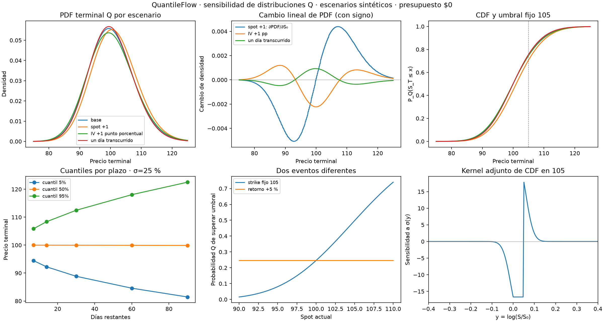

# QuantileFlow: sensibilidad de PDF, CDF, cuantiles y colas

Fecha: 9 de octubre de 2026. Presupuesto de datos: **US$0**.
Rama: `codex/pde-captura-gratis-20261009`. Base previa: `a5fa04dff33fc3d235efbbb81134d482afed9940`.

Implementé el siguiente paso del motor: medir cómo una distribución terminal
cambia al mover el spot, la volatilidad o el plazo restante. Incluye sensibilidades
de PDF, CDF, probabilidades de cola y cuantiles, además de adjuntos para perturbaciones
locales de la curva de volatilidad. Pasaron **287 pruebas** y el benchmark nuevo
comparó 15 distribuciones y 75 cuantiles con su referencia lognormal.

Todo este experimento es **sintético, europeo y neutral al riesgo Q**. No hubo
consultas a proveedores de mercado, compra de datos ni cambios de captura programada.
Estas probabilidades describen el modelo de valoración; no son probabilidades
físicas de retorno, señales direccionales ni confianza de una operación.

## 1. Lo que entrega el software

El módulo nuevo es `quantileflow/distribucion_pde.py`:

| Función o método | Resultado |
|---|---|
| `resolver_distribucion(...)` | Masas terminales Q y tangentes de volatilidad paralela y plazo |
| `evaluar(precios)` | PDF/CDF y sus derivadas respecto a spot, sigma y plazo |
| `cuantil(alpha)` | Precio del cuantil y sensibilidades por derivación implícita |
| `probabilidad_cola(precio, superior=True)` | Probabilidad de superar un umbral fijo y sus sensibilidades |
| `probabilidad_retorno(retorno)` | Probabilidad respecto a un umbral que se mueve con el spot |
| `gradiente_vol_cdf(precio)` | Sensibilidad de CDF a cada nodo de sigma(y), con un adjunto |
| `gradiente_vol_cuantil(alpha)` | Sensibilidad de un cuantil a cada nodo de sigma(y) |

Spot y umbrales se expresan por unidad del subyacente; sigma es anualizada;
plazo está en años con convenio calendario de 365 días. La API devuelve
derivadas por unidad absoluta del parámetro: para sigma +1 punto porcentual
multiplicar por 0.01; para un día transcurrido, multiplicar la derivada del
plazo por **−1/365**. El número de pasos temporales se mantiene fijo al derivar T.

El modelo mantiene fijas tasa, rendimiento continuo y sigma estática en
`y = log(S/S₀)`. Al mover el spot cambia la escala de precios. Todavía no deriva
la recalibración de una sonrisa de mercado ni la reacción de IV al stock.

## 2. Matemática y relación con el método adjunto

Se extrajeron el operador y el adjunto del módulo anterior `pde.py` para
compartir la discretización. No se duplicó una segunda dinámica de difusión.

```text
A = I − (T/M) G
A m[k+1] = m[k]
A dm_sigma[k+1] = dm_sigma[k] + (T/M) G_sigma m[k+1]
A dm_T[k+1] = dm_T[k] + G m[k+1]/M
```

Se resuelven dos tangentes hacia adelante porque hay dos parámetros globales
que afectan todas las medidas de la distribución. Para un objetivo puntual y
muchos parámetros de volatilidad espacial, se usa una pasada adjunta hacia atrás.
Es la combinación adecuada para este problema; no se ha medido una ventaja de
velocidad sobre otros métodos ni implementado diferenciación automática general.

Las masas terminales se normalizan, registrando también el error antes de esa
normalización. Se deriva la normalización tanto en tangentes como en adjuntos.
Para una CDF con pesos terminales w, el terminal del adjunto es `(w − F)/Z`,
con Z igual a la masa terminal original.

### Reconstrucción de densidad

Una PDF constante por celda produciría saltos al mover el spot. Se reconstruye
en log-precio con bases triangulares positivas de integral uno:

```text
p_y(y) = Σ m_j max(1 − |y−y_j|/h, 0) / h
p_S(x) = p_y(log(x/S₀)) / x
F_S(x) = F_y(log(x/S₀))
```

La PDF es lineal por tramos en y y la CDF es cuadrática por tramos. La integral
de la PDF es uno y las densidades son no negativas. Las derivadas firmadas de
la PDF integran cero: redistribuyen masa sin crear probabilidad.

**La derivada spot de la PDF no existe exactamente en los vértices de esa
reconstrucción.** Se devuelve `NaN` allí y un indicador
`pdf_spot_diferenciable`; no se inventa una derivada suave. La CDF y sus
derivadas de primer orden siguen continuas. El benchmark evita esos vértices
para comparar la derivada de PDF y verifica el caso por separado.

El precio europeo anterior promedia payoff por celda; la PDF nueva usa bases
triangulares. Comparten el operador y las masas, pero son **cuadraturas distintas**.
No se afirma una identidad exacta entre integrar esta PDF y ese precio por celda.
Antes de conectarlo al selector de contratos debemos unificar la cuadratura o
verificar y acotar su diferencia por refinamiento.

### Cuantiles y colas

Se invierte la CDF cuadrática con una fórmula estable. Para un parámetro theta:

```text
F(q_alpha, theta) = alpha
d q_alpha / d theta = −F_theta(q_alpha) / p_S(q_alpha)
```

La inversa es inestable si la densidad es muy pequeña. La API rechaza cuantiles
con densidad en y inferior a un umbral configurable y devuelve `1/pdf(q)` como
indicador de condición. Eso no sustituye la comprobación de dominio y malla.
La cola superior es `1−F`, por lo que sus sensibilidades cambian de signo.

## 3. Ejemplo entendible

Modelo sintético: spot 100, sigma 25 %, 30 días, tasa 4 % y rendimiento continuo
1.3 %. El evento es **terminar por encima del precio fijo 105**.

| Escenario | Probabilidad Q de superar 105 | Cuantil 5 % | Cuantil 95 % |
|---|---:|---:|---:|
| Base | 24.64 % | 88.85 | 112.47 |
| Spot pasa de 100 a 101 | 29.22 % | 89.74 | 113.60 |
| Sigma pasa de 25 % a 26 % | 25.39 % | 88.41 | 112.98 |
| Quedan 29 días en lugar de 30 | 24.28 % | 89.03 | 112.25 |

En este ejemplo, más volatilidad ensancha ambas colas; menos tiempo estrecha la
distribución; un spot mayor desplaza los precios terminales. Son resultados
condicionados a mantener los demás supuestos fijos, no comportamientos garantizados.

La aproximación lineal para spot +1 predice 29.05 %, frente a 29.22 % al resolver
de nuevo. La diferencia muestra por qué una derivada sirve para cambios pequeños
y debe contrastarse con escenarios completos si el movimiento es grande.

**Strike fijo y retorno fijo son eventos diferentes.** Si el objetivo pasa a
ser «subir +5 % desde el nuevo spot», el umbral también cambia. En este modelo
con sigma fija en coordenadas relativas, esa probabilidad es invariante al spot.
No debemos llamar señal direccional al cambio mecánico de probabilidad de superar
un strike que permanece fijo.



## 4. Verificación y precisión observada

Se ejecutó la suite completa, incluyendo los experimentos anteriores:
**287 pruebas pasadas**, de las cuales 17 son nuevas. La extracción del operador
compartido conserva las comprobaciones previas de precio y griegas europeas.

El benchmark nuevo usa cinco plazos (7/14/30/60/90 días), tres sigmas
(15/25/45 %), tres umbrales fijos (95.13/100.13/105.13) y cinco cuantiles
(1/5/50/95/99 %). Malla: 3,201 nodos, 2,400 pasos y semiancho logarítmico 1.5.

| Comprobación frente a referencia lognormal | Mayor error absoluto observado |
|---|---:|
| PDF | 0.000032031 |
| CDF | 0.000030997, equivalente a 0.00310 puntos porcentuales |
| Cuantil | 0.008363 unidades de precio |
| Derivada spot de PDF | 0.000485221 |
| Derivada sigma de PDF | 0.000538349 |
| Derivada anual de plazo de PDF | 0.00213323 |
| Derivada sigma de CDF | 0.000639063 |
| Derivada anual de plazo de CDF | 0.00227021 |
| Error de masa antes de normalizar | 4.40 × 10⁻¹² |

Estos límites corresponden a esas pruebas, no a todas las posibles superficies
y parámetros. La derivada spot de PDF es más sensible a la malla que la PDF
misma: su pendiente lineal tiene aproximación espacial de menor orden. El test
refina 401 a 3,201 nodos para verificar que mejora. La configuración por omisión
de 801 nodos es más económica y no tiene esos mismos límites de precisión.

Con una sigma espacial no constante, el adjunto se comparó con diferencias
centrales: error de CDF **1.81 × 10⁻¹⁰** y de cuantil **3.15 × 10⁻⁸**.
La suma del gradiente nodal coincide con la tangente paralela. Los restos de
Taylor caen por factores 3.9966 y 3.9983 al dividir el paso por dos.

También se verificaron integral y positividad de la reconstrucción,
complementariedad de colas, masa cero de derivadas, inversión de CDF,
colas mal condicionadas, umbrales inválidos y ausencia de mutaciones del vector
sigma del usuario. Se inspeccionó la gráfica generada.

Los resultados completos están en `experiments/distribucion_sensibilidad_20261009/resultados/`.
Son CSV sintéticos y JSON con métricas, versiones de Python/NumPy/SciPy y
SHA-256 de las fuentes normalizadas a LF para comparación entre plataformas.

## 5. Qué sigue

1. Unificar la reconstrucción usada para valorar payoff y para calcular
   probabilidades, y verificar su convergencia conjunta.
2. Conectar estas métricas al comparador de strikes/DTE bajo escenarios explícitos
   de spot, IV y tiempo, usando spreads y costos. No optimizar una ganancia
   esperada sin definir primero la distribución física del escenario.
3. Ensayar recuperación y sensibilidad de una sigma conocida a partir de
   cotizaciones sintéticas, antes de derivar una calibración de mercado.
4. Cuando haya claves configuradas, medir la captura gratuita ampliada de forma
   aislada y comprobar cobertura real. La falta de esa medición no impidió este avance.

El motor sigue sin ejercicio americano, dividendos en efectivo, recalibración
dependiente del spot ni deriva física aprendida. Sus trayectorias se almacenan
completas para los adjuntos: memoria O(nodos × pasos). Son límites explícitos
del benchmark y deberán resolverse según el instrumento y la tarea siguiente.
