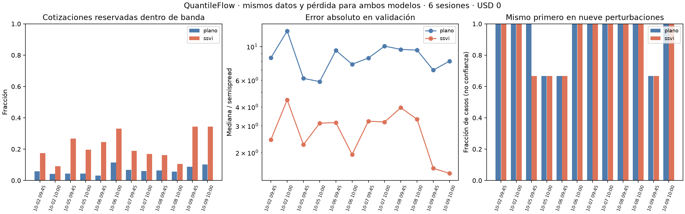

# QuantileFlow: skew, bandas y sensibilidad del ranking

Fecha: 10 de octubre de 2026. Presupuesto de datos: **US$0**.

Incorporamos una superficie de volatilidad con skew/smile y la comparamos con IV plana,
usando exactamente el mismo entrenamiento, pérdida de precios y strikes reservados.
**El skew mejora el ajuste, pero todavía no tenemos un selector de contratos validado.**
El siguiente trabajo debe separar el error del forward del ruido de cotizaciones antes
de interpretar los cambios de distribución como información direccional.

## Resultado principal

| Medida | IV plana ajustada por bandas | SSVI con skew y bandas |
|---|---:|---:|
| Cotizaciones reservadas dentro de bid/ask | 107/1,642: **6.52%** | 357/1,642: **21.74%** |
| Cortes cuyo primero cambia en las nueve perturbaciones | 3/12 | 4/12 |
| Sesiones cuyo primero cambia entre 09:45 y 10:00 | 6/6 | 5/6 |
| Cortes cuyo primero cambia al cambiar la hipótesis de plazo | 0/12 | 6/12 |
| Cortes donde efectivo supera el peor PnL de los tres escenarios de opciones | 12/12 | 12/12 |

SSVI reduce la mediana del error absoluto en **los doce cortes**. Las medianas pasan
de 5.87–12.67 semispreads con IV plana a 1.46–4.45 con SSVI. Ambos modelos eligen
el mismo primer contrato en 7/12 cortes. Ajustar mejor el precio no aseguró un ranking
más estable: esta es una conclusión del experimento, no una razón para escoger más parámetros.

Cada corte es una foto; los doce cortes pertenecen a **seis sesiones**, no a doce días
independientes. La fracción de perturbaciones que conserva un ganador no es una probabilidad
ni un intervalo de confianza.

## Datos y comparación justa

- Sesiones: 2, 5, 6, 7, 8 y 9 de octubre; cortes 09:45 y 10:00 de Nueva York.
- SPXW europeo, liquidación PM. Cuatro vencimientos por foto, con 27.25–33.30 días naturales
  hasta liquidación. No hay una prueba real de opciones de 7 o 14 DTE en esta muestra.
- 3,176 filas para entrenamiento y 1,642 reservadas para validación transversal.
- Se conserva cada tercer strike para validar, **con su call y put juntos**. Los restantes
  entrenan dentro de `|log(K/F)| <= 0.03`. Ningún modelo ve los precios reservados al ajustar.
- Mismos controles de cotización, referencia y universo para ambos modelos. Las filas cuya
  IV no se puede invertir en bid/mid/ask se excluyen mediante el adaptador común.
- Misma pérdida: distancia del precio a `[bid, ask]`, dividida por el semispread, más un
  término hacia un punto interior con peso 0.02. Se prueban preferencias bid, mid y ask
  sin ensanchar la banda. Ese término también afecta el mínimo fuera de banda; no es una
  restricción dura que obligue al ajuste a ser factible.
- Tres inicializaciones fijas por modelo, elegidas únicamente por costo de entrenamiento.
  IV plana tiene un parámetro por vencimiento, sin imponer monotonía temporal. SSVI ajusta
  cuatro varianzas ATM y tres parámetros comunes, con restricciones de arbitraje estático.

**La cifra anterior de 4.3% para IV plana no es el control de esta prueba.** Allí se usaba
la mediana de IV en una ventana ATM de 1%; aquí optimizamos precios sobre la misma ventana
de 3% que ve SSVI. El control correcto de esta entrega es 6.52%.

Los mismos días ya se habían inspeccionado y motivaron probar skew. Este resultado es
exploratorio: reservar strikes evita usar sus precios directamente, pero no convierte
estos días conocidos en una prueba temporal independiente de selección de modelo.

## La paridad revela un problema de referencia

Para un mismo strike, call y put europeos deben cumplir `C-P = D(F-K)`. La banda admisible
de la diferencia es `[bid_call-ask_put, ask_call-bid_put]`. Si excluye esa igualdad,
por lo menos una de las dos opciones quedará fuera de banda, independientemente del skew.

El cálculo independiente sobre **los pares de entrenamiento** dio:

| Referencia | Pares incompatibles |
|---|---:|
| Forward actual de SPX implícito más carry declarado | 1,337/1,588: **84.19%** |
| Mejor forward común posible por vencimiento, manteniendo el descuento | Al menos 394/1,588: **24.81%** |

El segundo control convierte cada par en un intervalo posible para F y calcula el máximo
número de intervalos que se solapan. Es un límite exacto para ese conjunto de pares y ese
descuento, con tolerancia numérica de 1e-9. No ajusta precios de opciones ni utiliza holdout.
Se agregó después de observar la discrepancia; **no se usó para cambiar el modelo ni los rankings**.

El forward influye mucho. No podemos atribuir el 84% completo al feed. Aun dejando F libre,
no hay un forward único que satisfaga todas esas bandas con el descuento declarado; por
lo menos 394 pares siguen obligando a dejar una opción fuera. No demuestra incompatibilidad
para cualquier descuento imaginable, ni identifica por sí solo el origen del ruido.

La tasa continua de 4% y el rendimiento de dividendos de 1.3% siguen siendo supuestos
provisionales de `configs/piloto.toml`. La referencia SPX se infiere por paridad de opciones
próximas al vencimiento del mismo proveedor; no es un spot independiente. Antes de buscar
señales, debemos examinar esas anclas y cuánto cambian las conclusiones al moverlas.

## Cómo se incorporó la distribución y el paso del tiempo

SSVI describe varianza implícita total `w(k,T)`, con `k=log(K/F)`. Su forma restringida
permite obtener una densidad Q no negativa a partir de la curvatura de los precios.
Usamos las condiciones suficientes de Gatheral–Jacquier ya implementadas en el proyecto.
Las 36 calibraciones SSVI de esta prueba convergen y cumplen dichas condiciones.
La malla adicional `k` entre -2 y 2 da un mínimo de g de 0.2543 en los doce ajustes nominales;
es un diagnóstico adicional, no el certificado analítico.
[Referencia original de SSVI](https://arxiv.org/abs/1204.0646).

Una prueba sintética independiente integra el payoff bajo la PDF y recupera el precio
Black de la misma superficie, además de comprobar masa, media y paridad. Esto vincula
el precio con la distribución. **Q no es la probabilidad física de ganar una operación.**

No tratamos la IV por strike como volatilidad local de la PDE. Eso requiere otra derivación
y validación. El nuevo valorador utiliza Black con la varianza SSVI y comparte la contabilidad
del comparador: compras al ask en el caso nominal, cantidades enteras, límite por tamaño
visible, comisiones y reserva de cierre. Al vencimiento prevalece el payoff; se rechazan
precios externos no finitos o fuera de las cotas europeas.

Probamos dos hipótesis de repricing, sin estimar su dinámica con estos datos:

1. **Tasa de varianza congelada, nominal.** Para cada vencimiento inicial, se mantiene la
   forma del smile en moneyness relativo al forward futuro y se multiplica la varianza
   total por `T_restante/T_original`. Cada slice conserva las cotas de mariposa.
2. **Superficie inicial al plazo restante, alternativa.** Se evalúa la superficie inicial
   en el plazo que queda, con la interpolación/extrapolación documentada. En esta muestra,
   los 24 candidatos por corte quedan debajo del primer plazo observado después de siete
   días: **toda esta alternativa extrapola en plazo**.

La segunda hipótesis cambia el ganador SSVI en 6/12 cortes. No sabemos cuál describe mejor
el mercado. Tener marginales Q coherentes por slice no prueba que hayamos estimado un proceso
dinámico conjunto del subyacente y la volatilidad.

## Qué significa la sensibilidad del ranking

El presupuesto de operación es **ficticio: US$10,000**; no es dinero asignado por el usuario.
Se comparan salida a siete días y movimientos de +1%, 0% y -1%, sin cambio adicional de IV.
El peor PnL de esa lista se compara con efectivo de PnL cero. No hay probabilidades estimadas
ni un estudio completo de escenarios adversos.

Las nueve perturbaciones combinan tres preferencias de ajuste dentro de las bandas y tres
precios de entrada hipotéticos, bid/mid/ask. Solo el ask es la convención nominal de compra;
bid/mid son controles favorables de sensibilidad, sin afirmar que se pueda comprar allí.
El semispread de salida es el mismo para ambos modelos y se supone igual a la mediana de
los semispreads actuales de los candidatos. No es un spread futuro observado.

Estas nueve perturbaciones no exploran todas las cotizaciones posibles dentro de todas
las bandas. Tampoco incluyen shocks de IV, costos variables o llenados reales. El tamaño
visible limita la cantidad asumida, pero no garantiza una ejecución futura. Un primero
estable en nueve casos todavía puede ser erróneo por una hipótesis común a los nueve.

## Integridad y comprobaciones

Se verificaron otra vez las huellas de las tablas, **32 manifiestos y 163 páginas crudas**,
incluido el contenido descomprimido. Los datos individuales y rankings detallados quedan
fuera del repositorio público; se publican códigos, protocolo, conteos, huellas y gráfica agregada.

Pasaron **358 pruebas de la suite** y **5 pruebas del control de forward**: 363 en total.
Las nuevas pruebas cubren recuperación de una smile sintética en strikes no ajustados,
PDF/precio/paridad, caso de smile plana, cotas del callback, presupuesto, costos, payoff
al vencer y máximo solapamiento de intervalos.

`verificar.py` recalcula independientemente los precios de entrenamiento y holdout usando
la fórmula normal, contrasta los conteos publicados y comprueba que call/put de un strike
no se repartieron entre grupos. También comprueba las huellas del código y los archivos
privados, y ausencia de campos individuales e identificadores reales en los JSON públicos.
Su evidencia está en `experiments/skew_bandas_20261010/resultados/verificacion.json`.
Reprodujo **9,636 precios**, con discrepancia máxima de **2.73e-12** por unidad de
subyacente, y todos los conteos de banda publicados. Se inspeccionó visualmente la gráfica.

Los **doce cortes siguen bloqueados para uso puntual**: feed indicative, SPX implícito y
referencia fuera de la regla de dos segundos. El modo descriptivo conserva esos bloqueos;
ningún ajuste de skew los convierte en precios operables. Alpaca documenta que indicative
modifica las cotizaciones.
[Documentación oficial del feed](https://docs.alpaca.markets/us/reference/optionlatestquotes).

## Siguientes pasos sin comprar datos

1. **Separar carry y error de referencia.** Congelar un contraste entre el forward actual
   y un forward estimado únicamente con pares de entrenamiento, con descuento declarado
   y sensibilidad a tasa/dividendos. Mantener las contradicciones registradas. No usar
   holdout para elegir F, descuentos, filtros o modelos.
2. **Repetir la comparación justa.** Mismos strikes reservados, universo, costos y plazo;
   reportar por vencimiento, no solo agregado. Mostrar cuánto de la mejora viene de F
   y cuánto del skew. No trasladar sin más el forward ajustado a una predicción de spot.
3. **Reservar cinco sesiones nuevas después de esta entrega.** Congelar reglas y código
   antes de inspeccionarlas, sin elegir días por resultado. Es la siguiente prueba de
   estabilidad temporal; no una prueba de rentabilidad.
4. **Estudiar sensibilidad de la PDF.** Sobre superficies que superen los controles,
   perturbar spot, plazo y parámetros del smile por separado; contrastar derivadas con
   diferencias finitas y registrar extrapolación. La versión con volatilidad local y
   adjuntos PDE necesita además validar la conversión de la superficie y su estabilidad.
5. **Selector de contratos solo después de esos controles.** Comparar ganancias, retorno,
   pérdida posible y sensibilidad a la hipótesis de smile. Los rangos 7/14 DTE necesitan
   capturas que realmente contengan esas expiraciones. La operación diaria sigue con su
   versión fijada; esta entrega no cambia workflows ni contrata servicios.

Código nuevo: `quantileflow/ajuste_bandas.py` y `experiments/skew_bandas_20261010/`.
El informe anterior se conserva con sus resultados y protocolo originales.
