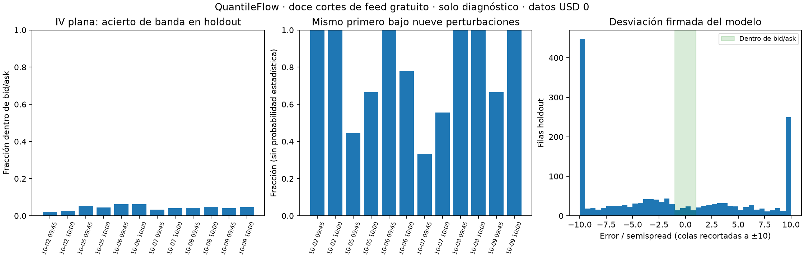

# QuantileFlow: prueba del comparador con cadenas gratuitas capturadas

Fecha: 10 de octubre de 2026. Datos: **US$0**. Base de código: `5944868`.
Rama: `codex/pde-captura-gratis-20261009`.

La prueba ya está hecha. El código de valoración funciona, pero **el baseline
de volatilidad plana no describe bien estas cadenas y el ranking es sensible
a las cotizaciones**. No tenemos todavía un selector validado de contratos.
La siguiente mejora debe incorporar skew y bandas, conservando controles y
validación fuera del ajuste. Estos resultados no justifican atribuir todo al
feed ni comprar datos ahora.

## Qué datos y controles se usaron

Se renormalizó el snapshot privado ya disponible para las sesiones del 2, 5,
6, 7, 8 y 9 de octubre. Son doce cortes: 09:45 y 10:00. Las tablas contienen
39,880 cotizaciones entre SPXW y SPY; esta prueba usa solamente **SPXW europeo PM**.
SPY queda fuera del motor PDE europeo, sin convertir su ejercicio americano.

Se verificaron **32 manifiestos y 163 páginas crudas únicas**, además de
huellas de tablas y cuerpos descomprimidos. Las huellas coinciden. Esto prueba
integridad del archivo, no fidelidad ni posibilidad de ejecución de sus precios.
No se descargaron nuevos datos de mercado ni se modificaron capturas/workflows.

Las cotizaciones vienen de `alpaca/indicative`. Alpaca describe ese feed como
cotizaciones modificadas derivadas de OPRA, por lo que sus bandas no acreditan
precios ejecutables. [Documentación oficial de Alpaca](https://docs.alpaca.markets/us/docs/historical-option-data).

SPX es una referencia inferida por paridad de un vencimiento cercano, no un
nivel independiente del índice. Su sello tiene entre **4.98 y 5.77 segundos**
de antigüedad; la regla puntual del piloto permite dos. Todos los sellos de
evento, snapshot, disponibilidad y recepción usados son conocidos y anteriores
o iguales al corte: no se utilizó una foto posterior para ajustar la anterior.

El adaptador conserva tres bloqueos: feed indicativo, referencia implícita y
desfase. En modo puntual devuelve cero candidatos; el experimento activa
explícitamente modo descriptivo y mantiene `apto_puntual=False`. **0/12 cortes
son aptos para decisiones puntuales bajo estos criterios.**

Los vencimientos no 0DTE disponibles abarcan aproximadamente **27.25–33.30
días** en la muestra. No se midieron opciones de 7/14 días. Usar siete días
como horizonte de salida no significa que existan contratos con DTE siete.

## Cómo se separó ajuste y validación

Se fijó `experiments/cadena_comparador_20261010/protocolo.toml` antes de medir
resultados. Se aplican las reglas existentes de edad, tamaños, spread y cotas.
Para cada vencimiento se selecciona ±3% de log-moneyness respecto del forward
contractual, con tasa 4% y q continuo 1.3% de referencia.

Cada tercer strike ordenado es validación reservada, para calls y puts juntos.
Los restantes dentro de ±1% alimentan una mediana de IV ATM. Con ella se
construye **una distribución de IV plana por vencimiento**. Las cotizaciones
de validación no participan de esa mediana. La separación es por strike dentro
de la misma foto; no es validación predictiva fuera de muestra temporal.

Esto evita el control engañoso de ajustar la IV individual al mid de cada
contrato y después celebrar que reproduce ese mismo mid. La prueba evalúa
qué describe un baseline común y simple, que aún omite el smile/skew.

## Resultados

| Control | Resultado |
|---|---:|
| Filas reservadas para validación | 1,642 |
| Precio PDE, malla 401/400, dentro de bid/ask | 71: **4.32%** |
| Precio PDE, malla 801/1,200, dentro de bid/ask | 69: **4.20%** |
| Black–Scholes analítico, misma IV plana, dentro de bid/ask | 68: **4.14%** |
| Cortes con primero distinto bajo perturbaciones de entrada/IV | **6/12** |
| Sesiones con primero distinto entre 09:45 y 10:00 | **5/6** |
| Primero nominal que se mantiene con malla más fina | **12/12** |
| Primero que se mantiene al perturbar SPX ±un error jackknife | **24/24** |

La mediana del desajuste del baseline analítico frente al mid equivale a
**5.56–12.52 semispreads**, según el corte. La mediana del error numérico PDE
frente a ese mismo Black–Scholes equivale a 0.17–0.40 semispreads. Refinar
reduce el error máximo de prima contra BS de 0.3154 a 0.0787 por unidad.
La discrepancia no se explica principalmente por la discretización PDE.

La mayor variación de PnL nominal de una posición ficticia al refinar fue
**US$41.44**. Mantener el primero no demuestra convergencia monetaria ni que
todo el orden del ranking sea idéntico. Se comprobó únicamente el primer
contrato nominal en esta prueba con cadenas.

El histograma recorta errores mayores a diez semispreads para visualizar las
colas. Las fracciones son conteos descriptivos, no probabilidades estimadas ni
intervalos de confianza. Las doce fotos no son doce sesiones independientes.

## Qué se perturbó en el comparador

Se toman calls/puts cercanos a tres moneyness por vencimiento. En el nominal
se compra a ask, con cantidad entera y reserva de ambas comisiones. La cantidad
no supera el tamaño del ask observado. Eso no acredita liquidez del feed ni
liquidez futura.

Se usa **capital ficticio US$10,000**, elegido para que SPXW tenga candidatos
asequibles en la prueba. No representa dinero tuyo disponible ni autorización
para operar. Quedaron 8–9 candidatos asequibles por corte. El semispread de
salida supuesto es la mediana de los semispreads de esos candidatos seleccionados
antes del filtro presupuestario; no una cotización futura.

Escenario objetivo: +1% en siete días. Controles: sin movimiento con IV tres
puntos menor y −1% con IV constante. Se cruzan nueve combinaciones de IV del
ajuste (mediana de IV bid/mid/ask del entrenamiento) y precio de entrada dentro
de bid/mid/ask. Comprar a bid/mid es una cota optimista para sensibilidad,
**no una ejecución prometida**. No se asignan probabilidades a esos escenarios.

En seis cortes aparecen 2–3 primeros diferentes dentro de las nueve variantes.
El robusto que incluye los tres escenarios conserva **efectivo en todos los
cortes**. Esto describe esta lista y estos supuestos; no mide rentabilidad
realizada ni predice el movimiento del subyacente.

Las perturbaciones ±un error jackknife del forward se usan como sensibilidad
local de la referencia, manteniendo IV y universo fijos. No constituyen un
intervalo de confianza ni cubren sesgo del feed, tasas/dividendos o una nueva
recalibración del conjunto.

## Código, privacidad y verificación

- `quantileflow/adaptador_comparador.py`: selección causal, metadatos,
  calibración ATM, separación por strike y bloqueos explícitos.
- `DistribucionPDE.precio_europeo`: misma integral que `valor_europeo`, sin
  adjuntos; hace viable el barrido. Las griegas completas siguen disponibles.
- `comparar_contratos`: límite opcional por cantidad y repricing PDE sin griegas.
  La contabilidad y la cuadratura se conservan; el límite también pasa a la API
  `comparar_con_pdf`.
- `evaluar_cadena.py`: integridad, holdout, perturbaciones y resultados agregados.
  `control_numerico.py`: contraste analítico independiente con la misma IV.

Pasaron **336 pruebas de la suite y cinco adicionales del auditor del crudo**.
Las 17 nuevas de la suite cubren causalidad, independencia del holdout,
desfase, feed mezclado, ejercicio, duplicados, calendario ACT/365 con cambio
de horario, falta de cotizaciones ATM, límites de cantidad y contabilidad del
precio sin adjunto. Las cinco adicionales detectan alteraciones de tabla,
manifiesto, página comprimida y cuerpo descomprimido.

Las cotizaciones por contrato, filas de evaluación, IV individuales y rankings
detallados están en una carpeta privada local fuera del repositorio público.
La salida pública contiene únicamente agregados, hashes, código y figura.
Los experimentos anteriores siguen registrados en sus commits originales:
sus hashes históricos no describen estos nuevos métodos.

## Siguientes pasos, con datos US$0

1. **Incorporar smile/skew con bandas.** Comparar IV plana y SSVI usando el
   mismo entrenamiento por strike y el mismo holdout; ambos ajustados sobre
   el rango necesario. Reportar casos sin una solución compatible con bandas,
   sin forzar un ajuste que borre discrepancias del feed.
2. **Separar sensibilidad a precio, IV y tamaño.** La prueba actual las combina.
   El próximo informe atribuirá los cambios de preferencia a cada factor y
   mostrará conjuntos de contratos indistinguibles dentro de las bandas.
3. **Ampliar expiraciones del piloto en una rama de mantenimiento.** Verificar
   selección, paginación y puntualidad para incluir 7/14/30 días sin perder
   cortes. La captura actual no permite comparar esos DTE reales.
4. **Resolver referencia y sincronía.** Mantener el desfase como bloqueo; estudiar
   una referencia contemporánea independiente o una regla de sincronía
   justificada con evidencia, antes de usar rankings puntuales.
5. **Evaluar decisiones solo después de esos controles.** Para dirección y
   probabilidad de ganancia hace falta evidencia temporal y probabilidades
   físicas calibradas. Esta revisión no aporta todavía una ventaja operable.
