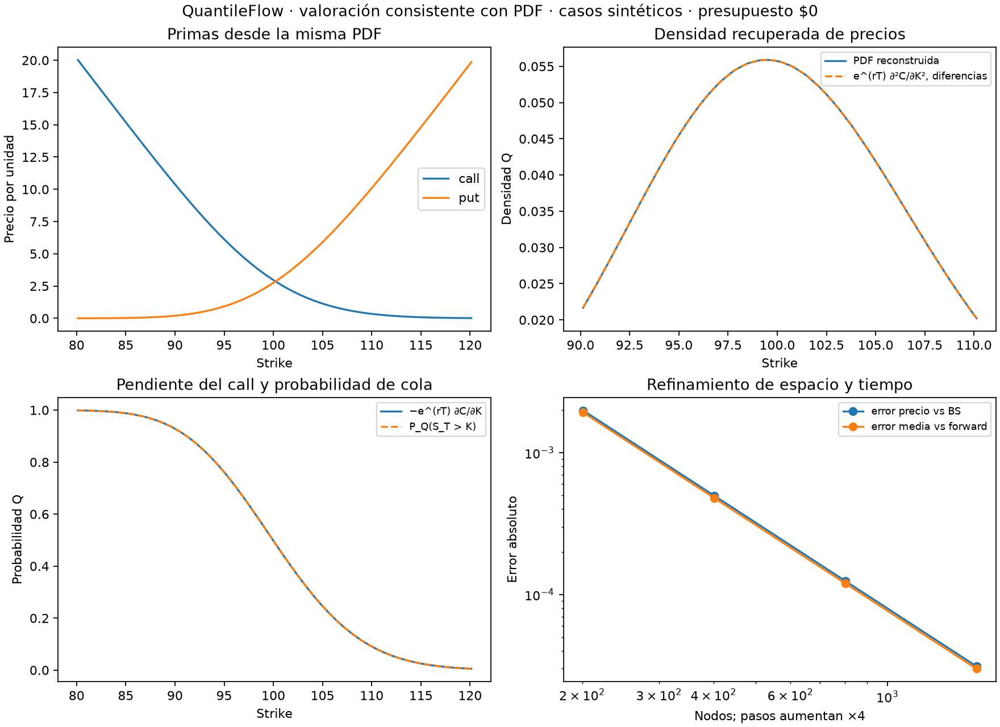

# QuantileFlow: precios y PDF con una sola reconstrucción

Fecha: 10 de octubre de 2026. Presupuesto de datos: **US$0**.
Rama: `codex/pde-captura-gratis-20261009`. Base: `8d05af583f7f0ba496fab34224b58dc6b0665ce4`.

Ya quedó unificada la valoración europea con la PDF triangular del motor.
Antes, la PDF usaba bases triangulares y el precio promediaba payoff por celda.
Ahora ambos usan la misma distribución reconstruida, con una integración
numérica del payoff consistente. Pasaron **302 pruebas**, incluyendo 15 nuevas,
y un benchmark de 90 calls/puts sintéticos.

Este paso resuelve la incompatibilidad de cuadraturas documentada en el informe
anterior. Todavía no selecciona el mejor contrato ni estima dirección: sigue
siendo un modelo europeo Q con sigma estática en coordenadas relativas al spot.
No se compraron datos, no se consultaron proveedores de mercado ni se modificó
la captura diaria.

## 1. Implementación

`DistribucionPDE.valor_europeo(strike, es_call=True)` integra y descuenta el
payoff contra las mismas bases triangulares que generan PDF, CDF, colas y
cuantiles. Cada mitad de cada base se divide en el strike para evitar integrar
una discontinuidad de pendiente. Se usa Gauss–Legendre de ocho puntos por tramo.

Calls y puts se integran directamente, evitando obtener un put OTM por resta
de dos valores grandes. La API devuelve:

- Precio, delta, gamma, vega paralela y sensibilidad al plazo restante.
- Sensibilidades a tasa y rendimiento continuo; pendiente y curvatura por strike.
- Gradiente adjunto respecto a todos los nodos de sigma.
- Media terminal de la PDF y su error frente a la media financiera teórica.
- Error entre valoración forward y backward y residual del adjunto.

`pde.resolver_europea(...)` conserva su interfaz y los campos de su resultado,
pero ahora delega en esta valoración. Se eliminó el promedio uniforme anterior:
las dos entradas al software ya no pueden elegir cuadraturas distintas.
Es un cambio deliberado de semántica numérica; los resultados históricos
permanecen ligados a sus commits originales.

## 2. Identidades comprobadas

Con descuento D, densidad p y CDF F de esta reconstrucción:

```text
C(K) = D ∫ max(s−K, 0) p(s) ds
P(K) = D ∫ max(K−s, 0) p(s) ds
∂C/∂K = −D [1−F(K)]
∂P/∂K = D F(K)
∂²C/∂K² = ∂²P/∂K² = D p(K)
C(K) − P(K) = D [E_Q(S_T)−K]
```

Para delta y gamma, sigma se mantiene fija en `y=log(S/S₀)`. Bajo esa convención:

```text
gamma_spot = D (K/S₀)² p(K)
```

Gamma respecto al stock y curvatura respecto al strike son derivadas diferentes.
Estas fórmulas no incluyen la recalibración de una superficie cuando cambia el spot.

La sensibilidad al plazo deriva tanto la masa terminal como el descuento:
`dV/dT = D gᵀ dm/dT − rV`. Para el paso de un día de calendario,
el cambio lineal es `−(dV/dT)/365`, manteniendo los demás supuestos.

La vega se calcula por tangente y se contrasta con la suma del gradiente nodal
adjunto. El terminal del adjunto incluye la normalización de masa. Una segunda
propagación backward del payoff proporciona otra valoración para comprobar dualidad.

## 3. Un límite importante: la media financiera

La paridad es consistente con **la media de la PDF que realmente usa el motor**.
No se fuerza esa media a `S₀ exp((r−q)T)`. La aproximación del generador,
Euler implícito, la reconstrucción y las fronteras reflectantes pueden introducir
un error de momento. Por eso se devuelve `error_media_financiera` como diferencia
firmada entre ambas medias.

En el benchmark, el mayor error absoluto de media fue **0.000030734** con spot
sintético 100. El refinamiento conjunto redujo ese error de 0.00192044 a
0.0000300066. Esto no garantiza la misma precisión para un dominio corto,
volatilidades extremas o una malla más gruesa.

No se afirma ausencia de arbitraje financiero entre todos los plazos ni exactitud
de la paridad clásica a malla finita. Sí se comprobaron positividad de primas,
monotonía por strike, la paridad con el momento de la distribución y las
identidades de densidad dentro de la tolerancia de integración.

## 4. Verificación independiente

Suite completa: **302 pruebas pasadas**. Las 15 nuevas cubren:

- Integración independiente de la PDF pública con `scipy.integrate.quad`,
  separada por nudos y strike, para calls/puts ITM, ATM y OTM.
- Igualdad de resultados entre la API de distribución y el adaptador de precios.
- Perturbaciones centrales de spot, sigma, plazo, tasa y rendimiento continuo.
- Pendiente/curvatura por strike y gamma por perturbaciones del spot.
- Paridad, forma por strike, convergencia del precio y del momento financiero.
- Gradiente espacial frente a perturbaciones de un campo no constante y Taylor.
- Rechazo de strikes y tipos de opción inválidos.

Benchmark adicional: cinco plazos 7/14/30/60/90 días, sigmas 15/25/45 %, strikes
90/100/110, calls/puts, spot 100, tasa 4 % y rendimiento continuo 1.3 %.
Malla de 1,601 nodos, 2,400 pasos y semiancho logarítmico 1.5.

| Medida | Mayor error observado |
|---|---:|
| Prima frente a Black–Scholes | 0.000445452 por unidad |
| Delta frente a BS | 0.0000378641 |
| Gamma frente a BS | 0.000226550 |
| Vega frente a BS, por incremento absoluto de sigma | 0.00215544 |
| Paridad con la media de la PDF | 4.80 × 10⁻¹⁴ |
| Valor forward frente a backward | 2.14 × 10⁻¹⁴ |
| Vega tangente frente a suma del adjunto | 2.14 × 10⁻¹³ |
| Precio frente a integración independiente, seis casos | 1.21 × 10⁻¹³ |
| PDF recuperada por diferencias segundas de calls, 61 strikes | 1.47 × 10⁻⁹ |

La última comprobación usa un paso de strike 0.01 y es una aproximación por
diferencias finitas, no una identidad exacta del operador numérico de diferencias.
Las tolerancias corresponden a los casos probados. No se extrapolan a cualquier
parámetro o a cotizaciones de mercado. Se inspeccionó la gráfica y pasó
`git diff --check`.



Los resultados son exclusivamente sintéticos. El JSON registra las métricas,
entorno y hashes de las fuentes normalizadas a LF. Los archivos anteriores
del 9 de octubre se conservan como registros históricos de `a5fa04d` y `8d05af5`;
sus hashes no describen este cambio de valoración.

## 5. Uso y siguiente paso

```python
from quantileflow.distribucion_pde import resolver_distribucion

d = resolver_distribucion(100, 30/365, .04, .013, .25,
                          nodos=1601, pasos=2400)
call = d.valor_europeo(105)
put = d.valor_europeo(105, es_call=False)
cola = d.probabilidad_cola(105)
cambio_por_dia = -call.sensibilidad_plazo / 365
```

Una distribución se puede reutilizar para diferentes strikes del mismo modelo
y vencimiento. Eso evita volver a resolver el estado forward por cada contrato,
aunque los adjuntos por payoff todavía requieren pasadas propias.

El siguiente paso es conectar esta API al comparador de contratos: movimiento
esperado, tiempo hasta salida, presupuesto, cambios de sigma y costos. Allí
debemos distinguir probabilidad Q de terminar ITM, probabilidad de superar el
break-even y resultados bajo escenarios físicos definidos por el usuario.
No escogeremos contratos maximizando una probabilidad Q como si fuera ganancia
esperada física.

Siguen pendientes calibración a una cadena real, ejercicio americano y dividendos
en efectivo. El modelo actual no debe sustituir el tratamiento americano de SPY.
El presupuesto de datos permanece en US$0.
