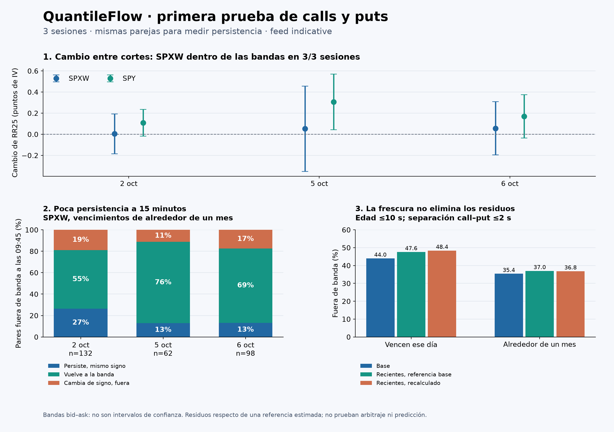

# QuantileFlow: primera prueba intradía de calls y puts

Informe cerrado el **7 de octubre de 2026**, con el snapshot auditado hasta el 6 de octubre. Sesiones: 2, 5 y 6 de octubre; cortes: 09:45 y 10:00, Nueva York. No incorpora posibles capturas posteriores. Feed: `indicative`. Código de captura: `4ffde8a`; datos: `66ccade`.

## Qué aprendimos

**Ya hicimos una prueba útil con los datos disponibles.** La medida agregada de asimetría de SPXW a 30 días cambia poco entre los dos horarios en relación con sus bandas de cotización. Los residuos individuales de paridad son mucho más inestables: de los que estaban fuera de banda a las 09:45 en vencimientos cercanos a un mes, solo **56 de 292 (19.2%)** siguen fuera con el mismo signo a las 10:00.

**Filtrar cotizaciones antiguas no elimina los residuos.** Manteniendo exactamente la misma muestra de pares recientes, recalcular la referencia reduce muy poco su frecuencia fuera de banda: de 37.0% a 36.8% en vencimientos cercanos a un mes. Por tanto, no podemos explicar todo por antigüedad. Tampoco podemos atribuir lo restante a una señal económica: el feed modifica las cotizaciones y la referencia es estimada internamente.

La siguiente prueba que priorizaría es comprobar esta inestabilidad a intervalos más cortos, con una referencia independiente o una muestra OPRA cuando esté disponible. **No entrenaría todavía un predictor direccional sobre estos residuos.**

## 1. Diseño de la prueba

- Emparejé call y put de **SPXW** con el mismo strike y vencimiento. Para comparar horarios, exigí también la misma fecha de sesión. Separé 0DTE de vencimientos cercanos a un mes.
- Reutilicé los controles de calidad del proyecto, sin relajar causalidad ni disponibilidad. Comprobé los sellos contra el corte y rechacé emparejamientos duplicados.
- El residuo es `e = C_mid − P_mid − D(F_sin_el_par − K)`. Para cada par, la referencia se calcula omitiéndolo del ajuste numérico. El ajuste robusto existente puede excluir observaciones extremas al estimar la referencia, pero **conservé sus residuos en los resultados**.
- En 0DTE fijé `D = exp(−0.04 T)`, como hace el nivel implícito existente. En los demás vencimientos estimé F y D como hace el módulo de cadenas. Son convenciones distintas y los segmentos se muestran por separado.
- La semibanda es `h = [(ask_call−bid_call) + (ask_put−bid_put)]/2`. Se cuenta «fuera de banda» cuando `|e| > h`. Esto no incluye incertidumbre de la referencia, comisiones, financiación ni ejecución de una cobertura.
- Para los resúmenes principales usé `|log(K/F)| ≤ 0.05`. El panel de cambios requiere cumplirlo en ambos cortes: es una selección descriptiva que utiliza ambas observaciones, **no una señal disponible a las 09:45**.
- Comparé tres filtros: base de edad máxima 60 segundos; edad ≤30 s y desfase entre patas ≤5 s; edad ≤10 s y desfase ≤2 s. No modifiqué la configuración productiva.

Se procesaron 30 cadenas de SPXW —cinco vencimientos por corte—. En la zona cercana al forward hay **2,215 observaciones de pares** sumando los seis cortes: 591 de 0DTE y 1,624 de plazo mensual. No son 2,215 días, operaciones independientes ni oportunidades de inversión.

La relación de paridad compara igual strike y vencimiento; comparar un call arriba del precio con un put abajo es otra medida de asimetría. [Referencia conceptual de OIC](https://www.optionseducation.org/advancedconcepts/put-call-parity).

## 2. Cambio de asimetría agregada entre 09:45 y 10:00

RR25 = IV del call a delta +0.25 menos IV del put a delta −0.25, interpolado a 30 días. Un cambio positivo significa que esa diferencia aumentó; **no equivale a una predicción alcista**.

| Sesión | Cambio SPXW, puntos de IV | Banda del cambio | ¿Excluye cero? |
|---|---:|---:|---|
| 2 de octubre | +0.004 | [−0.185, +0.193] | No |
| 5 de octubre | +0.052 | [−0.352, +0.456] | No |
| 6 de octubre | +0.057 | [−0.195, +0.308] | No |

Las bandas se construyen restando extremos bid–ask de los dos cortes. No son intervalos de confianza. «Incluye cero» significa que las bandas de medición se solapan, no que demostramos ausencia de cambio económico.

Como contraste secundario, reutilicé el RR25 de SPY de los diagnósticos ya auditados. El 5 de octubre cambia **+0.307 puntos de IV**, con banda **[+0.043, +0.571]**, que excluye cero. En los otros dos días se solapan las bandas. SPY tiene ejercicio americano y ajustes propios: este único caso merece repetición, no una conclusión direccional. No apliqué a SPY la prueba nueva de residuos europeos.

## 3. ¿Persisten los residuos del mismo par?

Vencimientos cercanos a un mes, dentro de la zona definida en ambos cortes:

| Sesión | Pares comunes | Fuera a las 09:45 | Persisten fuera, mismo signo | Vuelven a banda | Siguen fuera, signo contrario |
|---|---:|---:|---:|---:|---:|
| 2 de octubre | 319 | 132 | 35 (26.5%) | 72 | 25 |
| 5 de octubre | 216 | 62 | 8 (12.9%) | 47 | 7 |
| 6 de octubre | 270 | 98 | 13 (13.3%) | 68 | 17 |
| Total | 805 | 292 | **56 (19.2%)** | **187 (64.0%)** | **49 (16.8%)** |

En 0DTE hay 286 pares comunes: de 128 inicialmente fuera, 40 persisten con el mismo signo (31.3%), 61 vuelven a banda y 27 cambian de signo permaneciendo fuera.

Esto describe poca persistencia a 15 minutos. **No demuestra una estrategia rentable de reversión:** desconocemos el recorrido intermedio, los precios ejecutables y el comportamiento de la cobertura. Tampoco demuestra que no exista información predictiva: esa pregunta aún no se evaluó.

## 4. Antigüedad, separación temporal y spread

Para evitar confundir selección de datos con cambio del ajuste, congelé la muestra de pares recientes definida con la referencia base y repetí el cálculo sobre esos mismos pares.

| Segmento | Base completa | Solo recientes, referencia base | Mismos recientes, referencia recalculada |
|---|---:|---:|---:|
| 0DTE | 260/591 = 44.0% | 239/502 = 47.6% | 243/502 = 48.4% |
| Alrededor de un mes | 575/1,624 = 35.4% | 451/1,219 = 37.0% | 449/1,219 = 36.8% |

Los porcentajes son observaciones fuera de su banda. Los pares recientes tienen edad ≤10 s y separación entre call y put ≤2 s. El filtro reduce el residuo absoluto mediano, pero también selecciona bandas más estrechas; por eso puede subir la fracción fuera de banda sin que aumente la discrepancia absoluta.

Calculé correlaciones de rangos por vencimiento y corte para no mezclar directamente escalas entre cadenas. La mediana de las 30 correlaciones entre `|residuo|` y edad es **0.215**, y con el ancho de banda es **0.208**. Hay variación de signos entre cadenas. Son asociaciones descriptivas, sin control completo de moneyness ni otras variables y sin interpretación causal.

La correlación mediana entre `|residuo|/semibanda` y ancho es −0.578; dividir por el ancho introduce una relación mecánica. **No la interpreto como evidencia económica.** Los cientos de strikes comparten sesión y ajuste, así que no calculé p-valores tratándolos como muestras independientes.

### Control adicional: sensibilidad al descuento

El ajuste libre de las cadenas mensuales devuelve tasas implícitas entre **−9.85% y +15.99%**. No las considero una estimación fiable de las tasas de mercado. Tras observarlo, agregué una prueba de diagnóstico manteniendo los mismos 1,624 pares y fijando el descuento con tasas del 3%, 4% y 5% —un rango alrededor del supuesto actual del proyecto, no una curva observada—.

| Referencia mensual | Pares fuera de banda | Fracción |
|---|---:|---:|
| Descuento estimado libremente | 575 / 1,624 | 35.4% |
| Tasa fijada al 3% | 629 / 1,624 | 38.7% |
| Tasa fijada al 4% | 619 / 1,624 | 38.1% |
| Tasa fijada al 5% | 612 / 1,624 | 37.7% |

Los residuos persisten bajo esos supuestos; el porcentaje depende de la referencia. En 0DTE los tres supuestos conservan 260/591 pares fuera (44.0%). Este control refuerza que necesitamos validar el feed y la referencia; no justifica interpretar el residuo como información direccional.

## 5. Interpretación y siguiente experimento

El resultado favorece empezar con la asimetría agregada y su estabilidad, manteniendo los residuos como diagnóstico. La hipótesis «las anomalías desaparecen al quitar cotizaciones viejas» no se sostiene como explicación completa en esta muestra. Quedan abiertas al menos tres fuentes: modificación del feed, error de estimación de la referencia y movimientos reales no sincronizados.

Alpaca especifica que las cotizaciones `indicative` están modificadas respecto de OPRA. Esta limitación afecta directamente a una prueba que busca pequeñas diferencias entre precios. [Documentación del proveedor](https://docs.alpaca.markets/us/docs/historical-option-data).

Propongo el siguiente orden:

1. **Replicar sin cambiar reglas** con las próximas sesiones guardadas. Mantener este experimento y sus resultados como primera versión; reportar también los días que fallen.
2. **Referencia documentada:** sustituir la prueba exploratoria con tasas 3/4/5% por una curva con fuente y probar una referencia independiente cuando esté disponible. El leave-one-pair-out evita la autoexplicación directa del par, pero no es una validación temporal fuera de muestra y la selección robusta utiliza la cadena completa.
3. **Piloto con mayor frecuencia:** proponer capturas cada 30–60 segundos durante 10–15 minutos para distinguir fluctuaciones rápidas de desplazamientos persistentes. Antes de activarlo, revisar límites de API, costo, paginación y simultaneidad; no se cambió la captura existente en este trabajo.
4. **Contraste de feed:** repetir con OPRA cuando exista acceso y conservar la procedencia separada. La persistencia de residuos en `indicative` no justifica por sí sola operar ni comprar una suscripción.
5. **Retomar transporte:** sobre superficies válidas, medir cambios de cuantiles y colas y compararlos contra RR25. Con dos cortes diarios solo tenemos una diferencia intradía por sesión; no una trayectoria suficiente para una segunda derivada intradía fiable.

## 6. Qué se entregó y cómo se comprobó

- `explorar_intradia.py`: análisis parametrizado; produce agregados y guarda el detalle por par en una ruta privada explícita.
- `test_exploracion.py`: **cinco pruebas pasadas**. Dos casos de paridad exacta (D fijo/libre), una anomalía call inyectada, separación de fecha/vencimiento y rechazo de duplicados en el panel.
- `resultados/`: JSON y CSV agregados; incluye huellas SHA-256 de los cuatro Parquet de entrada, ajustes por cadena y controles de integridad ejecutados.
- `presentar_resultados.py` y `HALLAZGOS_INTRADIA.png`: figura regenerable a partir de agregados.
- `README.md`: instrucciones para reproducir.

También comprobé numéricamente la identidad del residuo y la equivalencia entre «fuera de banda» y `|e|/h > 1`, las marcas temporales y la unicidad de los pares. No modifiqué el código de producción, los workflows ni las tareas programadas. No publiqué datos por contrato ni ejecuté órdenes. El experimento utiliza las tablas de la auditoría previa; no descarga ni incorpora nuevas sesiones.

### Preparación para revisión en GitHub

La carpeta publicada es `experiments/intradia_20261007/`. Se agregó selección explícita de fechas y soporte para graficar muestras más largas, manteniendo las reglas originales. Pasan los cinco controles originales y cuatro nuevos de fechas: nueve pruebas en total. La ejecución por omisión reproduce los mismos seis archivos de agregados byte a byte. Este informe conserva sus cifras de las tres sesiones; la muestra de cinco debe procesarse por separado cuando estén disponibles sus entradas completas. El README incluye el comando.
