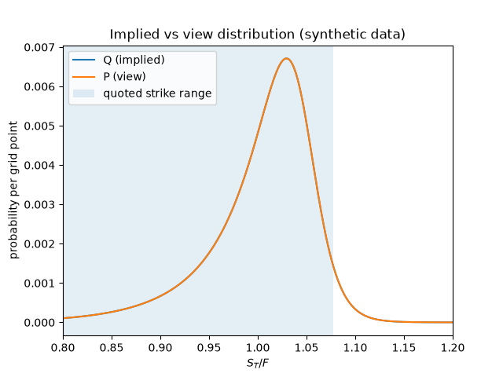
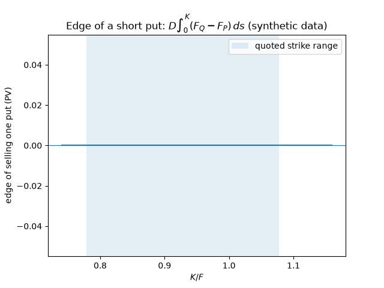
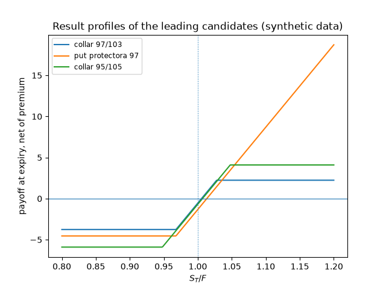
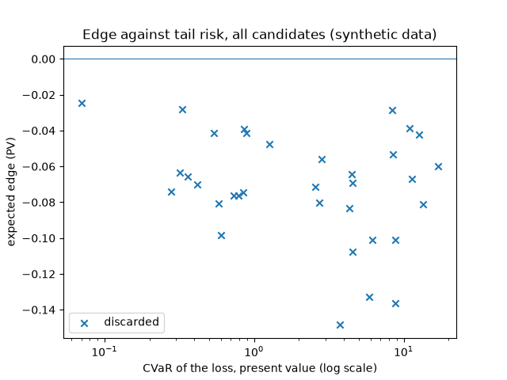

# Estrategias con puts: Sin opinión: P = Q, el control negativo del método

> **DATOS SINTÉTICOS.** Las cotizaciones las genera el propio código. Este documento es la plantilla del informe: sus cifras no dicen nada sobre ningún activo real, y en ningún caso son una recomendación de inversión.

- Configuración: `estrategias-0.1`; ejecución **adverso**, comisión 0.01 por pata y unidad.
- Vencimiento: 30.0 días; forward 100.2222; descuento 0.996718; 62 de 78 cotizaciones utilizables.
- Rango de strikes respaldado por cotizaciones: [78.00, 108.00], es decir [0.778, 1.078] en unidades del forward.
- `Q`: Q implícita (ajuste SSVI de la rebanada). `P`: vista neutral (P = Q).

## Dictamen

**ABSTENERSE.** Abstenerse: ninguna de las 35 candidatas evaluables pasa los filtros.

## En qué discrepa la vista del mercado

- Rendimiento esperado sobre el forward: **+0.00%**.
- Desviación típica de `ln(S_T/F)`: vista 0.0628 frente a implícita 0.0628 (factor 1.000).
- Asimetría: vista -1.995 frente a implícita -1.995.
- Probabilidad de caer un 5 %: vista 15.71% frente a implícita 15.71%. De caer un 10 %: 6.44% frente a 6.44%.
- Entropía relativa `KL(P||Q)`: **0.00000** nats (máximo admitido 0.02).

Toda la ventaja de cualquier estructura sale de estas diferencias. Si la vista fuera `P = Q`, la columna de ventaja sería exactamente cero antes de costos y negativa después.

### Ventaja de vender exposición a la caída, por tramo de precio

Cada fila es `D * int (F_Q - F_P) ds` sobre el tramo: positivo significa que el mercado asigna más probabilidad acumulada que la vista a esa zona, de modo que **vender** la caída dentro de ese tramo tiene ventaja. Es la descomposición que decide qué strike expresa la opinión.

| Desde | Hasta | Prob. Q | Prob. P | Ventaja |
|---|---|---|---|---|
| 80.18 | 90.20 | 0.0534 | 0.0534 | +0.00000 |
| 90.20 | 95.21 | 0.0926 | 0.0926 | +0.00000 |
| 95.21 | 97.72 | 0.0920 | 0.0920 | +0.00000 |
| 97.72 | 100.22 | 0.1493 | 0.1493 | +0.00000 |
| 100.22 | 102.73 | 0.2162 | 0.2162 | +0.00000 |
| 102.73 | 105.23 | 0.2315 | 0.2315 | +0.00000 |
| 105.23 | 110.24 | 0.1472 | 0.1472 | +0.00000 |
| 110.24 | 120.27 | 0.0068 | 0.0068 | +0.00000 |

La vista frente a la implícita. La banda marca el rango de strikes con cotizaciones utilizables: fuera de ella la forma de ambas distribuciones es extrapolación.

Ventaja de vender un put de cada strike. Su máximo señala dónde la discrepancia pesa más en prima; fuera de la banda, la curva depende de lo que nadie cotiza.

## Candidatas

Escenarios de robustez: base, ejecución al mid, convicción a la mitad, otra estimación de Q. La columna «peor» es la ventaja mínima entre ellos. «No fiable» es la parte de la ventaja que procede de la zona sin cotizaciones utilizables.

| Estructura | Papel | Ventaja | Peor | Capital | Sobre capital | CVaR | No fiable |
|---|---|---|---|---|---|---|---|
| collar 97/103 | comprar puts | -0.1485 | -0.1485 | 100.43 | -0.148% | 3.76 | — |
| put protectora 97 | comprar puts | -0.1076 | -0.1076 | 101.21 | -0.106% | 4.55 | — |
| collar 95/105 | comprar puts | -0.1330 | -0.1330 | 100.57 | -0.132% | 5.90 | — |
| put protectora 95 | comprar puts | -0.1010 | -0.1010 | 100.84 | -0.100% | 6.18 | — |
| put protectora 92 | comprar puts | -0.1011 | -0.1011 | 100.49 | -0.101% | 8.82 | — |
| collar 92/108 | comprar puts | -0.1365 | -0.1365 | 100.48 | -0.136% | 8.81 | — |
| put corto 92 | vender puts | -0.0287 | -0.0287 | 91.23 | -0.031% | 8.39 | — |
| reversal de riesgo -92p/+108c | vender puts | -0.0533 | -0.0533 | 91.30 | -0.058% | 8.46 | — |
| put corto 95 | vender puts | -0.0388 | -0.0388 | 93.88 | -0.041% | 11.05 | — |
| reversal de riesgo -95p/+105c | vender puts | -0.0669 | -0.0669 | 94.21 | -0.071% | 11.38 | — |
| put corto 97 | vender puts | -0.0423 | -0.0423 | 95.51 | -0.044% | 12.69 | — |
| reversal de riesgo -97p/+103c | vender puts | -0.0813 | -0.0813 | 96.37 | -0.084% | 13.55 | — |
| forward largo | sin puts | -0.0598 | -0.0598 | 99.95 | -0.060% | 17.15 | — |
| put spread alcista 87/92 | vender puts | -0.0643 | -0.0643 | 4.75 | -1.353% | 4.53 | — |
| put spread alcista 90/95 | vender puts | -0.0692 | -0.0692 | 4.55 | -1.519% | 4.57 | — |
| put spread alcista 92/97 | vender puts | -0.0836 | -0.0836 | 4.35 | -1.919% | 4.37 | — |
| put spread alcista 89/92 | vender puts | -0.0561 | -0.0561 | 2.84 | -1.977% | 2.85 | — |
| put spread alcista 94/97 | vender puts | -0.0714 | -0.0714 | 2.56 | -2.790% | 2.57 | — |
| put spread alcista 92/95 | vender puts | -0.0801 | -0.0801 | 2.72 | -2.946% | 2.73 | — |
| put largo 97 | comprar puts | -0.0477 | -0.0477 | 1.26 | -3.789% | 1.26 | — |
| call largo 103 | sin puts | -0.0391 | -0.0391 | 0.86 | -4.546% | 0.86 | — |
| put largo 95 | comprar puts | -0.0412 | -0.0412 | 0.89 | -4.626% | 0.89 | — |
| put largo 92 | comprar puts | -0.0413 | -0.0413 | 0.54 | -7.648% | 0.54 | — |
| call largo 105 | sin puts | -0.0280 | -0.0280 | 0.33 | -8.492% | 0.33 | — |
| call spread alcista 103/108 | sin puts | -0.0745 | -0.0745 | 0.85 | -8.762% | 0.85 | — |
| put spread bajista 92/97 | comprar puts | -0.0764 | -0.0764 | 0.79 | -9.677% | 0.79 | — |
| call spread alcista 103/106 | sin puts | -0.0761 | -0.0761 | 0.73 | -10.431% | 0.73 | — |
| put spread bajista 90/95 | comprar puts | -0.0808 | -0.0808 | 0.58 | -13.934% | 0.58 | — |
| put spread bajista 94/97 | comprar puts | -0.0986 | -0.0986 | 0.60 | -16.428% | 0.60 | — |
| put spread bajista 92/95 | comprar puts | -0.0699 | -0.0699 | 0.42 | -16.637% | 0.42 | — |
| put spread bajista 87/92 | comprar puts | -0.0657 | -0.0657 | 0.36 | -18.250% | 0.36 | — |
| call spread alcista 105/108 | sin puts | -0.0634 | -0.0634 | 0.32 | -19.815% | 0.32 | — |
| put spread bajista 89/92 | comprar puts | -0.0739 | -0.0739 | 0.28 | -26.379% | 0.28 | — |
| call largo 108 | sin puts | -0.0246 | -0.0246 | 0.07 | -35.162% | 0.07 | — |
| forward corto | sin puts | -0.0601 | -0.0601 | no acotado | — | 8.59 | — |

Resultado al vencimiento de las candidatas principales, neto de la prima capitalizada.

Ventaja esperada frente al CVaR de la pérdida. Las estructuras con más ventaja suelen ser también las de más cola: la puntuación penaliza el CVaR para no confundirlas.

## Vender o comprar puts

- Mejor forma de **vender** puts: `put corto 92` (alcista), ventaja -0.0287; descartada (ventaja esperada no positiva (-0.0287)).
- Mejor forma de **comprar** puts: `collar 97/103` (cobertura), ventaja -0.1485; descartada (ventaja esperada no positiva (-0.1485)).
- Mejor alternativa **sin** puts: `forward largo` (alcista), ventaja -0.0598; descartada (ventaja esperada no positiva (-0.0598)).

## Descartes

- `collar 97/103`: ventaja esperada no positiva (-0.1485); zona de no operación: la ventaja (-0.1485) no supera 1 veces el coste de ejecución más el residuo del ajuste (0.1485 = 0.1449 + 0.0035); la ventaja desaparece en el escenario «convicción a la mitad» (-0.1485); rendimiento esperado sobre capital -0.148% por debajo de 0.300%.
- `put protectora 97`: ventaja esperada no positiva (-0.1076); zona de no operación: la ventaja (-0.1076) no supera 1 veces el coste de ejecución más el residuo del ajuste (0.1076 = 0.1049 + 0.0026); la ventaja desaparece en el escenario «convicción a la mitad» (-0.1076); rendimiento esperado sobre capital -0.106% por debajo de 0.300%.
- `collar 95/105`: ventaja esperada no positiva (-0.1330); zona de no operación: la ventaja (-0.1330) no supera 1 veces el coste de ejecución más el residuo del ajuste (0.1330 = 0.1299 + 0.0030); la ventaja desaparece en el escenario «convicción a la mitad» (-0.1330); rendimiento esperado sobre capital -0.132% por debajo de 0.300%.
- `put protectora 95`: ventaja esperada no positiva (-0.1010); zona de no operación: la ventaja (-0.1010) no supera 1 veces el coste de ejecución más el residuo del ajuste (0.1010 = 0.0999 + 0.0010); la ventaja desaparece en el escenario «convicción a la mitad» (-0.1010); rendimiento esperado sobre capital -0.100% por debajo de 0.300%.
- `put protectora 92`: ventaja esperada no positiva (-0.1011); zona de no operación: la ventaja (-0.1011) no supera 1 veces el coste de ejecución más el residuo del ajuste (0.1011 = 0.0949 + 0.0062); la ventaja desaparece en el escenario «convicción a la mitad» (-0.1011); rendimiento esperado sobre capital -0.101% por debajo de 0.300%.
- `collar 92/108`: ventaja esperada no positiva (-0.1365); zona de no operación: la ventaja (-0.1365) no supera 1 veces el coste de ejecución más el residuo del ajuste (0.1365 = 0.1249 + 0.0116); la ventaja desaparece en el escenario «convicción a la mitad» (-0.1365); rendimiento esperado sobre capital -0.136% por debajo de 0.300%.
- `put corto 92`: ventaja esperada no positiva (-0.0287); zona de no operación: la ventaja (-0.0287) no supera 1 veces el coste de ejecución más el residuo del ajuste (0.0413 = 0.0350 + 0.0063); la ventaja desaparece en el escenario «base» (-0.0287); rendimiento esperado sobre capital -0.031% por debajo de 0.300%.
- `reversal de riesgo -92p/+108c`: ventaja esperada no positiva (-0.0533); zona de no operación: la ventaja (-0.0533) no supera 1 veces el coste de ejecución más el residuo del ajuste (0.0767 = 0.0650 + 0.0117); la ventaja desaparece en el escenario «base» (-0.0533); rendimiento esperado sobre capital -0.058% por debajo de 0.300%.
- `put corto 95`: ventaja esperada no positiva (-0.0388); zona de no operación: la ventaja (-0.0388) no supera 1 veces el coste de ejecución más el residuo del ajuste (0.0412 = 0.0400 + 0.0012); la ventaja desaparece en el escenario «base» (-0.0388); rendimiento esperado sobre capital -0.041% por debajo de 0.300%.
- `reversal de riesgo -95p/+105c`: ventaja esperada no positiva (-0.0669); zona de no operación: la ventaja (-0.0669) no supera 1 veces el coste de ejecución más el residuo del ajuste (0.0731 = 0.0700 + 0.0031); la ventaja desaparece en el escenario «base» (-0.0669); rendimiento esperado sobre capital -0.071% por debajo de 0.300%.
- `put corto 97`: ventaja esperada no positiva (-0.0423); zona de no operación: la ventaja (-0.0423) no supera 1 veces el coste de ejecución más el residuo del ajuste (0.0477 = 0.0450 + 0.0027); la ventaja desaparece en el escenario «base» (-0.0423); rendimiento esperado sobre capital -0.044% por debajo de 0.300%.
- `reversal de riesgo -97p/+103c`: ventaja esperada no positiva (-0.0813); zona de no operación: la ventaja (-0.0813) no supera 1 veces el coste de ejecución más el residuo del ajuste (0.0887 = 0.0850 + 0.0037); la ventaja desaparece en el escenario «base» (-0.0813); rendimiento esperado sobre capital -0.084% por debajo de 0.300%.
- `forward largo`: ventaja esperada no positiva (-0.0598); zona de no operación: la ventaja (-0.0598) no supera 1 veces el coste de ejecución más el residuo del ajuste (0.0601 = 0.0599 + 0.0001); la ventaja desaparece en el escenario «convicción a la mitad» (-0.0598); rendimiento esperado sobre capital -0.060% por debajo de 0.300%.
- `put spread alcista 87/92`: ventaja esperada no positiva (-0.0643); zona de no operación: la ventaja (-0.0643) no supera 1 veces el coste de ejecución más el residuo del ajuste (0.0657 = 0.0650 + 0.0007); la ventaja desaparece en el escenario «base» (-0.0643); rendimiento esperado sobre capital -1.353% por debajo de 0.300%.
- `put spread alcista 90/95`: ventaja esperada no positiva (-0.0692); zona de no operación: la ventaja (-0.0692) no supera 1 veces el coste de ejecución más el residuo del ajuste (0.0808 = 0.0750 + 0.0058); la ventaja desaparece en el escenario «base» (-0.0692); rendimiento esperado sobre capital -1.519% por debajo de 0.300%.
- `put spread alcista 92/97`: ventaja esperada no positiva (-0.0836); zona de no operación: la ventaja (-0.0836) no supera 1 veces el coste de ejecución más el residuo del ajuste (0.0836 = 0.0800 + 0.0036); la ventaja desaparece en el escenario «base» (-0.0836); rendimiento esperado sobre capital -1.919% por debajo de 0.300%.
- `put spread alcista 89/92`: ventaja esperada no positiva (-0.0561); zona de no operación: la ventaja (-0.0561) no supera 1 veces el coste de ejecución más el residuo del ajuste (0.0739 = 0.0650 + 0.0089); la ventaja desaparece en el escenario «base» (-0.0561); rendimiento esperado sobre capital -1.977% por debajo de 0.300%.
- `put spread alcista 94/97`: ventaja esperada no positiva (-0.0714); zona de no operación: la ventaja (-0.0714) no supera 1 veces el coste de ejecución más el residuo del ajuste (0.0986 = 0.0850 + 0.0136); la ventaja desaparece en el escenario «base» (-0.0714); rendimiento esperado sobre capital -2.790% por debajo de 0.300%.
- `put spread alcista 92/95`: ventaja esperada no positiva (-0.0801); zona de no operación: la ventaja (-0.0801) no supera 1 veces el coste de ejecución más el residuo del ajuste (0.0801 = 0.0750 + 0.0051); la ventaja desaparece en el escenario «base» (-0.0801); rendimiento esperado sobre capital -2.946% por debajo de 0.300%.
- `put largo 97`: ventaja esperada no positiva (-0.0477); zona de no operación: la ventaja (-0.0477) no supera 1 veces el coste de ejecución más el residuo del ajuste (0.0477 = 0.0450 + 0.0027); la ventaja desaparece en el escenario «convicción a la mitad» (-0.0477); rendimiento esperado sobre capital -3.789% por debajo de 0.300%.
- `call largo 103`: ventaja esperada no positiva (-0.0391); zona de no operación: la ventaja (-0.0391) no supera 1 veces el coste de ejecución más el residuo del ajuste (0.0409 = 0.0400 + 0.0009); la ventaja desaparece en el escenario «convicción a la mitad» (-0.0391); rendimiento esperado sobre capital -4.546% por debajo de 0.300%.
- `put largo 95`: ventaja esperada no positiva (-0.0412); zona de no operación: la ventaja (-0.0412) no supera 1 veces el coste de ejecución más el residuo del ajuste (0.0412 = 0.0400 + 0.0012); la ventaja desaparece en el escenario «convicción a la mitad» (-0.0412); rendimiento esperado sobre capital -4.626% por debajo de 0.300%.
- `put largo 92`: ventaja esperada no positiva (-0.0413); zona de no operación: la ventaja (-0.0413) no supera 1 veces el coste de ejecución más el residuo del ajuste (0.0413 = 0.0350 + 0.0063); la ventaja desaparece en el escenario «convicción a la mitad» (-0.0413); rendimiento esperado sobre capital -7.648% por debajo de 0.300%.
- `call largo 105`: ventaja esperada no positiva (-0.0280); zona de no operación: la ventaja (-0.0280) no supera 1 veces el coste de ejecución más el residuo del ajuste (0.0320 = 0.0300 + 0.0020); la ventaja desaparece en el escenario «convicción a la mitad» (-0.0280); rendimiento esperado sobre capital -8.492% por debajo de 0.300%.
- `call spread alcista 103/108`: ventaja esperada no positiva (-0.0745); zona de no operación: la ventaja (-0.0745) no supera 1 veces el coste de ejecución más el residuo del ajuste (0.0745 = 0.0700 + 0.0045); la ventaja desaparece en el escenario «convicción a la mitad» (-0.0745); rendimiento esperado sobre capital -8.762% por debajo de 0.300%.
- `put spread bajista 92/97`: ventaja esperada no positiva (-0.0764); zona de no operación: la ventaja (-0.0764) no supera 1 veces el coste de ejecución más el residuo del ajuste (0.0836 = 0.0800 + 0.0036); la ventaja desaparece en el escenario «convicción a la mitad» (-0.0764); rendimiento esperado sobre capital -9.677% por debajo de 0.300%.
- `call spread alcista 103/106`: ventaja esperada no positiva (-0.0761); zona de no operación: la ventaja (-0.0761) no supera 1 veces el coste de ejecución más el residuo del ajuste (0.0761 = 0.0700 + 0.0061); la ventaja desaparece en el escenario «convicción a la mitad» (-0.0761); rendimiento esperado sobre capital -10.431% por debajo de 0.300%.
- `put spread bajista 90/95`: ventaja esperada no positiva (-0.0808); zona de no operación: la ventaja (-0.0808) no supera 1 veces el coste de ejecución más el residuo del ajuste (0.0808 = 0.0750 + 0.0058); la ventaja desaparece en el escenario «convicción a la mitad» (-0.0808); rendimiento esperado sobre capital -13.934% por debajo de 0.300%.
- `put spread bajista 94/97`: ventaja esperada no positiva (-0.0986); zona de no operación: la ventaja (-0.0986) no supera 1 veces el coste de ejecución más el residuo del ajuste (0.0986 = 0.0850 + 0.0136); la ventaja desaparece en el escenario «convicción a la mitad» (-0.0986); rendimiento esperado sobre capital -16.428% por debajo de 0.300%.
- `put spread bajista 92/95`: ventaja esperada no positiva (-0.0699); zona de no operación: la ventaja (-0.0699) no supera 1 veces el coste de ejecución más el residuo del ajuste (0.0801 = 0.0750 + 0.0051); la ventaja desaparece en el escenario «convicción a la mitad» (-0.0699); rendimiento esperado sobre capital -16.637% por debajo de 0.300%.
- `put spread bajista 87/92`: ventaja esperada no positiva (-0.0657); zona de no operación: la ventaja (-0.0657) no supera 1 veces el coste de ejecución más el residuo del ajuste (0.0657 = 0.0650 + 0.0007); la ventaja desaparece en el escenario «convicción a la mitad» (-0.0657); rendimiento esperado sobre capital -18.250% por debajo de 0.300%.
- `call spread alcista 105/108`: ventaja esperada no positiva (-0.0634); zona de no operación: la ventaja (-0.0634) no supera 1 veces el coste de ejecución más el residuo del ajuste (0.0634 = 0.0600 + 0.0034); la ventaja desaparece en el escenario «convicción a la mitad» (-0.0634); rendimiento esperado sobre capital -19.815% por debajo de 0.300%.
- `put spread bajista 89/92`: ventaja esperada no positiva (-0.0739); zona de no operación: la ventaja (-0.0739) no supera 1 veces el coste de ejecución más el residuo del ajuste (0.0739 = 0.0650 + 0.0089); la ventaja desaparece en el escenario «convicción a la mitad» (-0.0739); rendimiento esperado sobre capital -26.379% por debajo de 0.300%.
- `call largo 108`: ventaja esperada no positiva (-0.0246); zona de no operación: la ventaja (-0.0246) no supera 1 veces el coste de ejecución más el residuo del ajuste (0.0354 = 0.0300 + 0.0054); la ventaja desaparece en el escenario «convicción a la mitad» (-0.0246); rendimiento esperado sobre capital -35.162% por debajo de 0.300%.
- `forward corto`: ventaja esperada no positiva (-0.0601); zona de no operación: la ventaja (-0.0601) no supera 1 veces el coste de ejecución más el residuo del ajuste (0.0601 = 0.0599 + 0.0001); la ventaja desaparece en el escenario «base» (-0.0601); pérdida no acotada por arriba; capital inmovilizado no acotado: hace falta un margen declarado.

## Lo que este informe no dice

- **No hay evidencia de que la vista acierte.** La ventaja es una resta entre lo que dice la vista y lo que dice el precio; si la vista está mal, el signo se invierte.
- **El CVaR y la pérdida máxima se calculan bajo la vista**, que es justamente la parte optimista del cálculo. La pérdida real de un put vendido llega cuando la vista falla.
- **El capital es una regla propia** (peor caso en valor presente), no el margen que exigiría un intermediario, que depende de su propio modelo y puede cambiar intradía.
- **La probabilidad de ganar no es un criterio.** Un put muy fuera del dinero gana casi siempre y eso ya está en su precio; se reporta porque se suele mirar.
- No hay ejecución, ni gestión de la posición antes del vencimiento, ni asignación anticipada, ni dividendos, ni impuestos, ni límite de concentración entre vencimientos.
