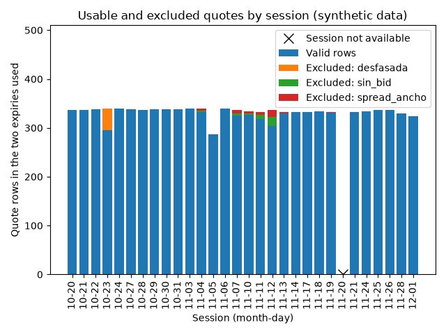
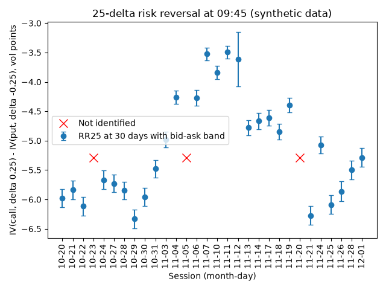
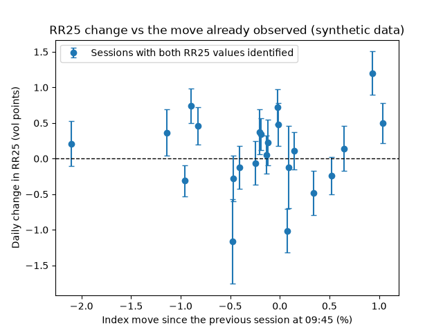
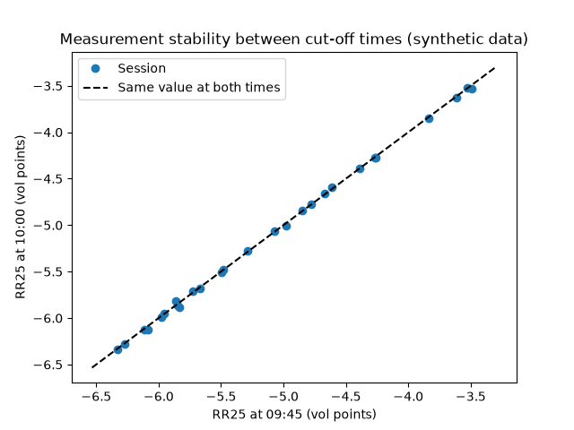

# Informe piloto: plantilla con datos sintéticos

> **DATOS SINTÉTICOS.** Datos generados por el código, no de mercado: este documento es la plantilla del informe piloto. Sus cifras no dicen nada sobre SPX ni sobre ninguna señal.

- Configuración: `piloto-0.3` (huella `8d6dc48abb9f`); instrumento SPXW (europeo, liquidación PM), subyacente SPX.
- Corte principal 09:45 y secundario 10:00 (America/New_York); plazo constante de 30 días naturales; etiquetas a 1, 5 sesiones.
- Sesiones: 30, del 2025-10-20 al 2025-12-01.
- Fuentes: opciones sintetico/nbbo_intervalos_sintetico; referencia de las opciones SPX sintetico/indice_sintetico (observado); objetivo SPY sintetico/sip_sintetico (observado).
- Entradas y hashes: `manifiesto.json`.

## Dictamen de datos

**Apto con limitaciones.**

| Criterio | Valor | Umbral | Cumple | Crítico |
|---|---:|---|---|---|
| Sesiones en la muestra | 30 | >= 20 | sí |  |
| RR25 a 30 días identificada a la hora principal | 0.900 | >= 0.9 | sí |  |
| Cambio diario de RR25 disponible | 0.793 | >= 0.8 | no |  |
| Estabilidad 09:45-10:00 (mediana de la diferencia absoluta / ancho de banda) | 0.041 | <= 1.0 | sí |  |
| Sesiones con alertas de sincronía, edad o disponibilidad | 0.067 | <= 0.2 | sí |  |
| Etiqueta del objetivo a 1 sesión disponible | 0.933 | >= 0.9 | sí |  |

Un criterio crítico incumplido hace el dictamen «insuficiente»; uno no crítico, «apto con limitaciones». Los umbrales están en la configuración y son provisionales.

**Alcance**, aparte de la aptitud de los datos:

- Medición: sintética.
- Referencia de las opciones: observado.
- Precio objetivo: observado; instrumento: SPY, distinto de SPX: otro instrumento, con sus dividendos, gastos y diferencias de seguimiento.
- Rendimiento del objetivo: total: dividendos en efectivo sumados en su fecha ex; el de precio va aparte.
- Dividendos del objetivo: 36 consultas completas, la última recibida el 2026-09-26T12:00:00+00:00. Cada etiqueta madura con la primera consulta completa posterior a su fin que cubre el periodo (provisional) y se reconcilia con una recibida 60 días después del fin.
- Rendimiento total a 1 sesión, por estado de sus dividendos: 0 provisionales, 28 reconciliadas, 0 revisadas.
- Evaluación con precios de mercado: no permitida: datos sintéticos.

## Calidad de los datos

- Sesiones procesadas: 29 de 30.
- No disponible el 2025-11-20: sin precio de SPX al corte de 2025-11-20.
- Exclusiones acumuladas a la hora principal: desfasada 45, spread_ancho 40, sin_bid 38.
- Ancho mediano de spread: 16.7 ticks.
- Sesiones con alertas: 2.

## Señales

Convenciones: `RR25 = IV(call, delta +0.25) - IV(put, delta -0.25)` con delta forward sin descuento, `N(d1)` y `N(d1) - 1`; positivo significa mayor volatilidad en el call comparable. La asimetría a distancia logarítmica simétrica compara el call en `F * 1.03` con el put en `F / 1.03`. Ambas se interpolan a plazo constante en varianza total, pata por pata, y su banda sale de bid y ask. El cambio diario usa la sesión anterior del calendario, a la misma hora y plazo.

La relación visual entre cambios de RR25 y movimientos es exploratoria: este piloto no evalúa capacidad predictiva.

## Estabilidad entre 09:45 y 10:00

Mediana de |RR25(10:00) - RR25(09:45)|: 0.01 puntos; mediana del ancho de banda a las 09:45: 0.30 puntos.

## Tabla diaria

Completa en `tabla_diaria.csv` (hora principal) y `tabla_todas_las_horas.csv`. RR25 y cambios en puntos de volatilidad; rendimientos en porcentaje. El movimiento previo es de la referencia de las opciones (SPX, regla puntual); los rendimientos a 1 y 5 sesiones son totales del objetivo (SPY, regla histórica).

| Sesión | RR25 | Banda | Cambio | Asim. log | Válidas/filas | Alertas | Mov. previo ref. | Rend. 1 obj. | Rend. 5 obj. |
|---|---:|---|---:|---:|---|---:|---:|---:|---:|
| 2025-10-20 | -5.98 | [-6.14, -5.82] |  | -5.56 | 336/336 | 0 |  | 0.65 | 0.87 |
| 2025-10-21 | -5.84 | [-6.00, -5.68] | 0.14 | -5.46 | 336/336 | 0 | 0.65 | -0.47 | -0.18 |
| 2025-10-22 | -6.12 | [-6.28, -5.96] | -0.28 | -5.89 | 338/338 | 0 | -0.47 | 1.24 | 0.63 |
| 2025-10-23 | no identificada |  |  |  | 295/340 | 0 | 1.24 | -0.31 | -0.80 |
| 2025-10-24 | -5.67 | [-5.82, -5.51] |  | -5.50 | 340/340 | 0 | -0.32 | -0.24 | -0.50 |
| 2025-10-27 | -5.73 | [-5.88, -5.58] | -0.06 | -5.74 | 338/338 | 0 | -0.25 | -0.40 | 0.78 |
| 2025-10-28 | -5.85 | [-6.00, -5.70] | -0.12 | -5.62 | 336/336 | 0 | -0.41 | 0.34 | 1.16 |
| 2025-10-29 | -6.33 | [-6.49, -6.17] | -0.48 | -6.02 | 338/338 | 2 | 0.34 | -0.20 | 0.59 |
| 2025-10-30 | -5.96 | [-6.11, -5.80] | 0.38 | -5.65 | 338/338 | 0 | -0.20 | -0.01 | 0.79 |
| 2025-10-31 | -5.48 | [-5.63, -5.33] | 0.48 | -5.71 | 338/338 | 0 | -0.02 | 1.05 | -0.08 |
| 2025-11-03 | -4.98 | [-5.11, -4.85] | 0.50 | -6.07 | 339/340 | 0 | 1.04 | -0.02 | -2.08 |
| 2025-11-04 | -4.26 | [-4.37, -4.14] | 0.72 | -5.85 | 332/340 | 0 | -0.02 | -0.22 | -2.25 |
| 2025-11-05 | no identificada |  |  |  | 287/287 | 0 | -0.23 | -0.00 | -1.93 |
| 2025-11-06 | -4.27 | [-4.40, -4.14] |  | -5.63 | 339/340 | 0 | -0.01 | -0.89 | -2.40 |
| 2025-11-07 | -3.52 | [-3.63, -3.42] | 0.74 | -5.47 | 325/336 | 0 | -0.89 | -0.95 | -1.36 |
| 2025-11-10 | -3.84 | [-3.95, -3.72] | -0.31 | -5.47 | 327/334 | 0 | -0.96 | -0.19 | -0.54 |
| 2025-11-11 | -3.49 | [-3.60, -3.39] | 0.34 | -5.47 | 318/332 | 0 | -0.19 | 0.09 | 0.17 |
| 2025-11-12 | -3.61 | [-4.08, -3.15] | -0.12 |  | 304/336 | 0 | 0.09 | -0.47 | -0.74 |
| 2025-11-13 | -4.78 | [-4.91, -4.65] | -1.16 | -6.28 | 329/332 | 0 | -0.47 | 0.15 | -0.25 |
| 2025-11-14 | -4.67 | [-4.80, -4.53] | 0.11 | -5.68 | 332/332 | 0 | 0.14 | -0.13 | -0.17 |
| 2025-11-17 | -4.61 | [-4.74, -4.48] | 0.06 | -5.64 | 332/332 | 0 | -0.14 | 0.53 | 0.90 |
| 2025-11-18 | -4.85 | [-4.99, -4.72] | -0.24 | -5.63 | 334/334 | 2 | 0.52 | -0.82 |  |
| 2025-11-19 | -4.39 | [-4.52, -4.27] | 0.46 | -5.44 | 331/332 | 0 | -0.83 | 0.03 | 1.16 |
| 2025-11-20 | no identificada |  |  |  | 0/0 | 0 |  | 0.23 | 0.00 |
| 2025-11-21 | -6.27 | [-6.43, -6.12] |  | -6.15 | 332/332 | 0 |  | 0.94 | -2.32 |
| 2025-11-24 | -5.07 | [-5.22, -4.93] | 1.20 | -5.12 | 334/334 | 0 | 0.93 |  | -4.98 |
| 2025-11-25 | -6.09 | [-6.24, -5.93] | -1.01 | -5.81 | 336/336 | 0 | 0.08 |  |  |
| 2025-11-26 | -5.86 | [-6.03, -5.70] | 0.23 | -5.49 | 336/336 | 0 | -0.12 | -1.13 | -5.73 |
| 2025-11-28 | -5.50 | [-5.66, -5.34] | 0.36 | -5.24 | 330/330 | 0 | -1.14 | -2.09 | -3.24 |
| 2025-12-01 | -5.29 | [-5.44, -5.13] | 0.21 | -4.99 | 324/324 | 0 | -2.11 | -1.72 | -1.21 |

## Ejemplos

### Sesión normal

**2025-10-24**: procesada; RR25 identificada.
Vencimiento 2025-11-21 (28.3 días): 170 de 170 filas válidas; exclusiones: ninguna.
Vencimiento 2025-11-28 (35.2 días): 170 de 170 filas válidas; exclusiones: ninguna.

### Sesión problemática

**2025-10-23**: procesada; RR25 no identificada (vencimiento a 29.3 días: ningún tramo de puts válidos cruza |delta| = 0.25).
Vencimiento 2025-11-21 (29.3 días): 147 de 170 filas válidas; exclusiones: desfasada 23.

| Strike | Tipo | k = ln(K/F) | Motivos |
|---:|---|---:|---|
| 5700 | put | -0.0203 | desfasada |
| 5690 | put | -0.0221 | desfasada |
| 5680 | put | -0.0238 | desfasada |
| 5670 | put | -0.0256 | desfasada |
| 5660 | put | -0.0273 | desfasada |
| 5650 | put | -0.0291 | desfasada |

Vencimiento 2025-11-28 (36.2 días): 148 de 170 filas válidas; exclusiones: desfasada 22.

| Strike | Tipo | k = ln(K/F) | Motivos |
|---:|---|---:|---|
| 5700 | put | -0.0208 | desfasada |
| 5690 | put | -0.0226 | desfasada |
| 5680 | put | -0.0243 | desfasada |
| 5670 | put | -0.0261 | desfasada |
| 5660 | put | -0.0278 | desfasada |
| 5650 | put | -0.0296 | desfasada |

## Limitaciones

- El objetivo, SPY, es otro instrumento que el subyacente de las opciones (SPX): tiene sus dividendos, gastos y diferencias de seguimiento. Su precio es el mid de la última cotización válida en el corte: referencia estadística, no precio de ejecución.
- Las etiquetas a 5 sesiones se solapan: no son observaciones independientes.
- La referencia del forward usa una tasa y un rendimiento de dividendo fijos de la configuración, no una curva con fuente.
- Los umbrales de calidad y del dictamen son provisionales hasta revisar este piloto.
- Hay sesiones sin hora de evento en las cotizaciones: en ellas la edad es desconocida y el control de desfase no se aplicó.
