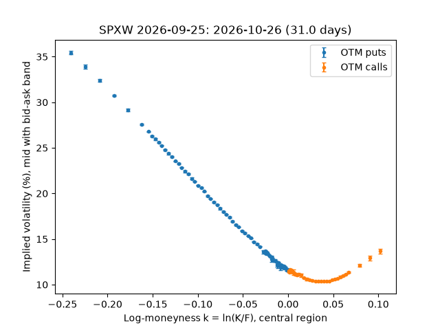
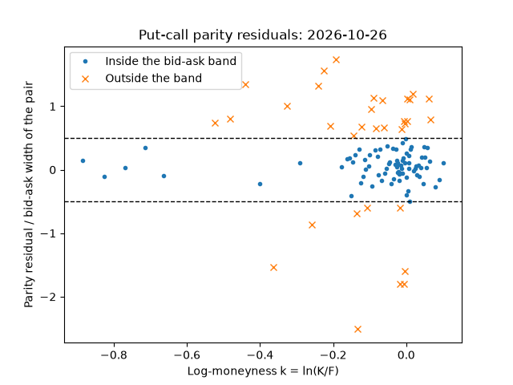

# Verificación de capturas de Alpaca: 2026-09-25

Generado por `scripts/verificar_alpaca.py` desde el crudo. Solo agregados y medidas derivadas.

## Captura `2026-09-25Tinmediata-185224`

- Modo inmediata, corte 2026-09-25T20:00:00.000000Z, feed de opciones `indicative`, cuenta paper; desfase del reloj local 0.241 s.
- 10 respuestas (1.6 MB sin comprimir) en 0.71 s; errores 0; respuestas después del corte 10.
- Cobertura: 3250 contratos con cotización de 3250; sin cotización 0; sin metadatos 0.
- **Recibida con el mercado cerrado**: cotizaciones del cierre; se omitieron las horas de snapshot y de disponibilidad. No es una sesión del piloto.
- SPX implícito: identificado, 7741.49 con 182 pares del 2026-09-28 (error del forward 0.142); SPY (IEX) 771.34; razón SPX/SPY 10.0365.

### SPXW

| Vencimiento | Días | Válidas/filas | Bid en grilla | Ancho cerca (ticks) | Edad mediana (s) | Pares | Fuera de banda | Mediana abs(res)/ancho | Tasa implícita | RR25 (pts) |
|---|---:|---|---:|---:|---:|---:|---:|---:|---:|---:|
| 2026-09-28 | 3.0 | 425/486 | 9 % | 4.0 | 1 | 182 | 28 % | 0.24 | — | -0.76 |
| 2026-10-22 | 27.0 | 261/274 | 11 % | 12.2 | 1 | 124 | 26 % | 0.21 | 7.26 % | -3.13 |
| 2026-10-23 | 28.0 | 357/372 | 13 % | 12.5 | 1 | 171 | 20 % | 0.20 | 2.48 % | -3.21 |
| 2026-10-26 | 31.0 | 235/244 | 13 % | 14.1 | 1 | 113 | 28 % | 0.22 | 4.82 % | -3.02 |
| 2026-10-27 | 32.0 | 230/242 | 15 % | 13.2 | 1 | 109 | 25 % | 0.21 | -0.62 % | -3.25 |

Exclusiones: sin_bid 77, sin_tamano 77, spread_ancho 33, desfasada 2.
A 30 días (2026-10-23, 2026-10-26): RR25 identificada = -3.08 puntos, banda [-3.24, -2.93]; asimetría logarítmica identificada = -3.58 puntos.

### SPY

| Vencimiento | Días | Válidas/filas | Bid en grilla | Ancho cerca (ticks) | Edad mediana (s) | Pares | Fuera de banda | Mediana abs(res)/ancho | Tasa implícita | RR25 (pts) |
|---|---:|---|---:|---:|---:|---:|---:|---:|---:|---:|
| 2026-10-16 | 21.0 | 396/458 | 99 % | 12.5 | 0 | 173 | 21 % | 0.18 | -10.77 % | -2.83 |
| 2026-10-23 | 28.0 | 334/342 | 99 % | 17.0 | 0 | 164 | 8 % | 0.12 | -7.23 % | -3.07 |
| 2026-10-30 | 35.0 | 493/498 | 99 % | 19.1 | 0 | 245 | 22 % | 0.23 | 2.49 % | -3.46 |
| 2026-11-06 | 42.0 | 334/334 | 99 % | 30.5 | 0 | 167 | 13 % | 0.13 | -4.04 % | -3.78 |

Exclusiones: sin_bid 58, sin_tamano 58, fuera_de_cotas 17, desfasada 2.
A 30 días (2026-10-23, 2026-10-30): RR25 identificada = -3.20 puntos, banda [-3.31, -3.10]; asimetría logarítmica identificada = -3.60 puntos.

